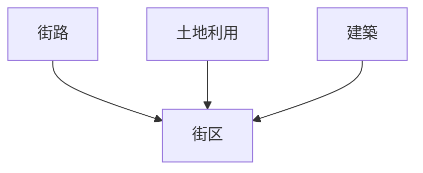
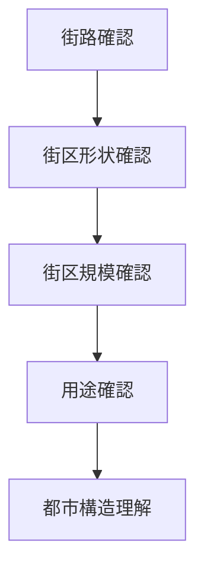

# 街区分析

## 概要

街区分析とは  
**都市における街区（Block）の形状・規模・用途を分析する方法**である。

街区は

- 街路
- 土地利用
- 建築

によって形成される都市空間単位である。

街区を分析することで

- 都市計画
- 都市形成
- 都市機能

を理解できる。

---

# 街区の基本構造

---

# 街区の主な要素

## 街区形状

街区の形。

例

- 四角形
- 長方形
- 不規則形

特徴

- 計画都市では規則的
- 自然都市では不規則

---

## 街区規模

街区の大きさ。

観察ポイント

- 街区長さ
- 街区面積

特徴

- 商業街区は小さい
- 住宅街区は大きい

---

## 街区用途

街区の機能。

例

- 商業街区
- 住宅街区
- 行政街区

---

## 建築配置

街区内の建築配置。

例

- 密集
- 庭付き住宅
- 中庭型

---

# 街区タイプ

## 碁盤目街区

特徴

- 規則的
- 計画都市

例

- 京都

---

## 不規則街区

特徴

- 曲線街路
- 自然発生都市

例

- 城下町

---

## 大街区

特徴

- 大規模施設

例

- 行政地区

---

# 街区分析の手順

---

# フィールドワークでの質問

1 街