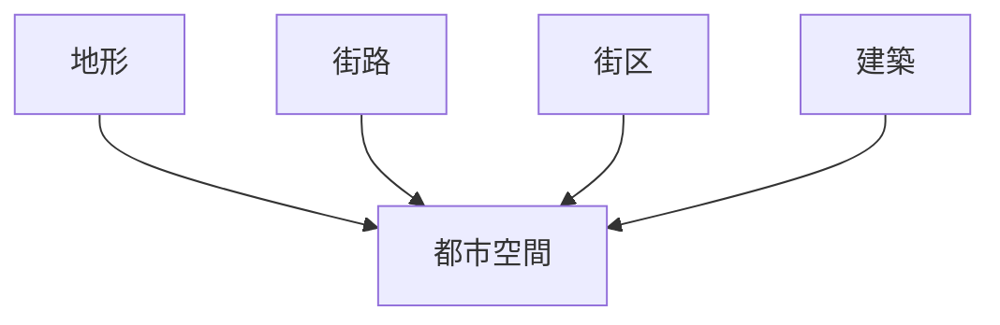
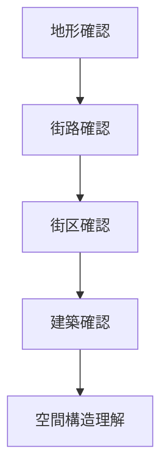

# 空間構造分析

## 概要

空間構造分析とは  
**都市や地域の空間構造を分析する方法**である。

都市は

- 地形
- 街路
- 街区
- 建築

によって構成される。

これらの関係を分析することで

- 都市形成
- 都市機能
- 都市景観

を理解できる。

---

# 空間構造の基本構造

---

# 主な空間要素

## 地形

都市立地の基盤。

例

- 台地
- 河岸段丘
- 盆地

---

## 街路

都市骨格。

例

- 碁盤目
- 放射型
- 曲線型

---

## 街区

土地分割構造。

例

- 武家地
- 商業地
- 住宅地

---

## 建築

都市景観構成要素。

例

- 町家
- 武家屋敷
- 寺院

---

# 分析手順

---

# フィールドワーク質問

1 地形は何か  
2 街路構造はどうか  
3 街区はどう分割されているか  
4 建築はどう配置されているか  

---

# 目的

- 都市形成理解  
- 空間構造理解  

---

# 関連ノート

- [[土地利用分析]]
- [[都市レイヤー]]
- [[街路観察チェックリスト]]