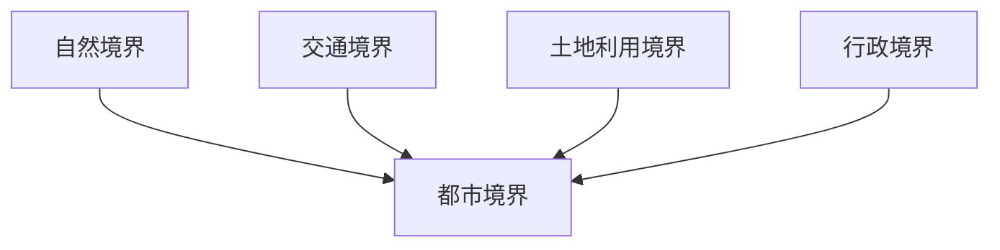
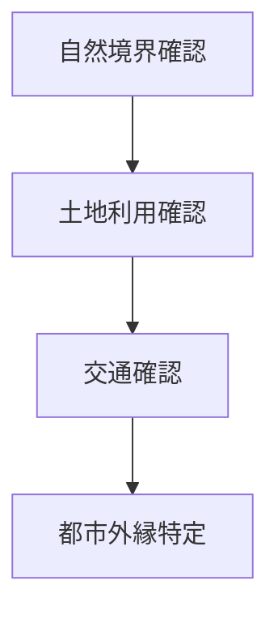

# 都市境界分析

## 概要

都市境界分析とは  
**都市の範囲や境界を特定し、その形成要因を分析する方法**である。

都市には

- 自然境界
- 人工境界
- 機能境界

が存在する。

境界を分析することで

- 都市構造
- 都市拡張
- 都市機能

を理解できる。

---

# 都市境界の基本構造

---

# 境界タイプ

## 自然境界

例

- 山
- 河川
- 海

特徴

- 都市拡張制約

---

## 交通境界

例

- 鉄道
- 高速道路

特徴

- 都市分断

---

## 土地利用境界

例

- 市街地
- 農地

特徴

- 都市外縁

---

## 行政境界

例

- 市境
- 区境

特徴

- 制度境界

---

# 分析手順

---

# フィールドワーク質問

1 市街地はどこで終わるか  
2 都市外縁は何で区切られるか  
3 境界は自然か人工か  

---

# 目的

- 都市範囲理解  
- 都市拡張理解  

---

# 関連ノート

- [[空間構造分析]]
- [[土地利用分析]]