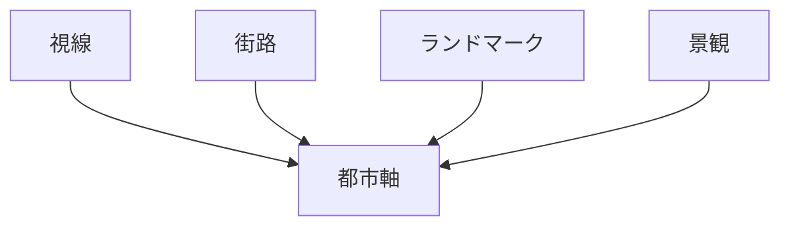
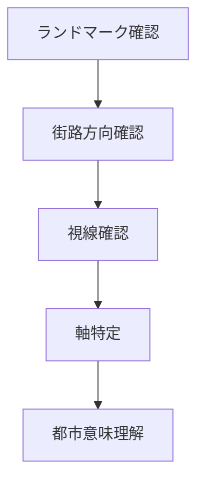

# 都市軸分析

## 概要

都市軸分析とは  
**都市空間の中で重要な方向性（軸）を分析する方法**である。

都市では

- 視線
- 街路
- 景観
- 宗教

などが特定の方向に配置されることがある。

この方向構造を

都市軸

という。

都市軸を理解することで

- 都市設計
- 都市象徴
- 景観構造

を理解できる。

---

# 都市軸の基本構造

---

# 都市軸の主なタイプ

## 視線軸

特徴

- 視界の抜け
- 景観焦点

例

- 城
- 山
- 寺院

---

## 街路軸

特徴

- 直線道路
- 都市中心

例

- パリ
- ワシントン

---

## 景観軸

特徴

- 景観ライン
- 観光景観

例

- 神社参道
- 河川景観

---

## 宗教軸

特徴

- 信仰方向

例

- 神社参道
- 寺院配置

---

# 都市軸分析の手順

---

# フィールドワークでの質問

1 街の中心からどこが見えるか  
2 重要な建物はどこを向いているか  
3 直線的な街路はどこか  
4 景観の焦点はどこか  

---

# 例

### 京都

都市軸

- 山を背景にした景観

特徴

- 碁盤目街路

---

### 金沢

都市軸

- 城
- 河川

特徴

- 城下町構造

---

### 神社参道

都市軸

- 鳥居
- 本殿

特徴

- 宗教軸

---

# 分析の目的

都市軸分析の目的は以下である。

- 景観構造理解  
- 都市象徴理解  
- 観光景観理解  

---

# 関連ノート

- [[空間構造分析]]
- [[都市中心分析]]
- [[景観観察チェックリスト]]
- [[都市レイヤー]]