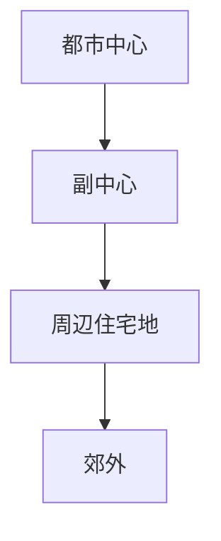
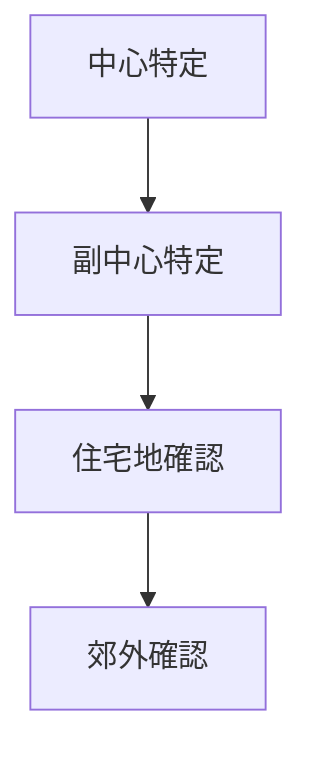

# 都市階層分析

## 概要

都市階層分析とは  
**都市内部の中心と周辺の階層構造を分析する方法**である。

都市には

- 中心
- 副中心
- 周辺

という階層が存在する。

---

# 都市階層の基本構造

---

# 主な都市階層

## 都市中心

特徴

- 商業集中
- 交通集中

---

## 副中心

特徴

- 地域商業

---

## 住宅地

特徴

- 居住中心

---

## 郊外

特徴

- 低密度

---

# 分析手順

---

# フィールドワーク質問

1 都市の中心はどこか  
2 副中心はあるか  
3 住宅地はどこか  

---

# 目的

- 都市構造理解  
- 機能分布理解  

---

# 関連ノート

- [[都市中心分析]]
- [[土地利用分析]]