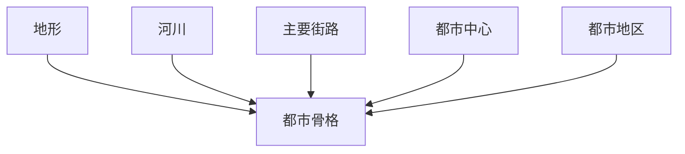
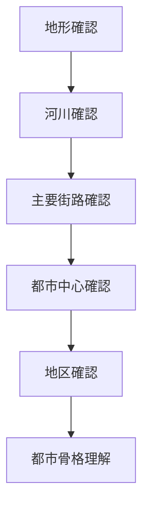

# 都市骨格分析

## 概要

都市骨格分析とは  
**都市を構成する基本構造（骨格）を抽出する分析方法**である。

都市は複雑に見えるが、実際には

- 地形
- 河川
- 街路
- 中心

などの要素によって基本構造が形成されている。

この骨格を理解することで

- 都市構造
- 都市形成
- 都市景観

を理解できる。

---

# 都市骨格の基本構造

---

# 都市骨格の主要要素

## 地形

都市の基盤。

例

- 山
- 段丘
- 海岸
- 盆地

観察ポイント

都市は地形によって制約される。

関連ノート

- [[地形解釈]]

---

## 河川

都市構造の軸。

例

- 鴨川
- 隅田川

観察ポイント

河川は

- 境界
- 景観軸

になる。

関連ノート

- [[河川分析]]

---

## 主要街路

都市の動線。

例

- 大通り
- 街道

観察ポイント

人と交通の流れ。

関連ノート

- [[都市軸分析]]

---

## 都市中心

都市活動の中心。

例

- 駅
- 商業中心
- 城

関連ノート

- [[都市中心分析]]

---

## 都市地区

都市の機能区域。

例

- 商業地区
- 住宅地区
- 観光地区

関連ノート

- [[都市イメージ分析]]

---

# 都市骨格分析の手順

---

# フィールドワーク質問

1 都市はどの地形の上にあるか  
2 河川は都市にどう影響しているか  
3 主要な街路はどこか  
4 都市中心はどこか  
5 地区はどう分かれているか  

---

# 例

### 京都

地形

盆地

河川

鴨川

主要街路

四条通

都市中心

四条河原町

---

### 金沢

地形

河岸段丘

河川

浅野川  
犀川

都市中心

香林坊

---

### 東京

地形

台地と低地

河川

隅田川

都市中心

東京駅  
新宿

---

# 分析の目的

都市骨格分析の目的は以下である。

- 都市構造理解  
- 都市形成理解  
- 観光都市理解  

---

# 関連ノート

- [[地図読解法]]
- [[都市軸分析]]
- [[河川分析]]
- [[都市中心分析]]
- [[都市イメージ分析]]