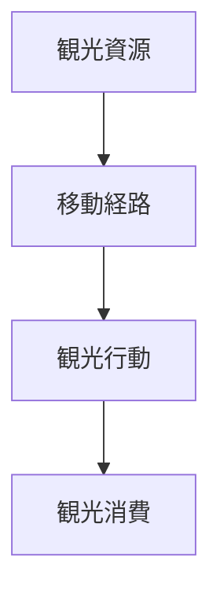
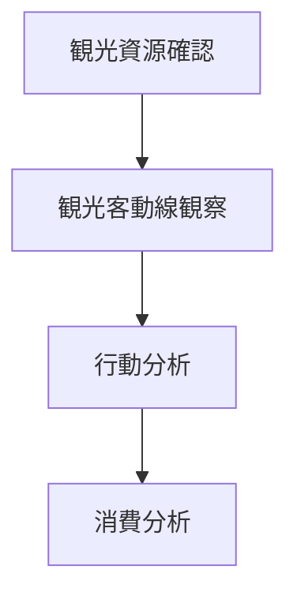

# 観光動線分析

## 概要

観光動線分析とは  
**観光客の移動経路を分析する方法**である。

観光地では

観光資源 → 観光動線 → 観光消費

という構造が形成される。

---

# 観光動線の基本構造

---

# 観光動線要素

## 観光資源

例

- 寺院
- 景観
- 商業

---

## 移動経路

例

- 観光ルート
- 徒歩ルート

---

## 観光行動

例

- 写真
- 食事
- 買い物

---

## 観光消費

例

- 飲食
- 土産

---

# 分析手順

---

# フィールドワーク質問

1 観光客はどこから来るか  
2 どこを回るか  
3 どこで消費するか  

---

# 目的

- 観光構造理解  
- 観光計画  

---

# 関連ノート

- [[観光客観察チェックリスト]]
- [[交通観察チェックリスト]]