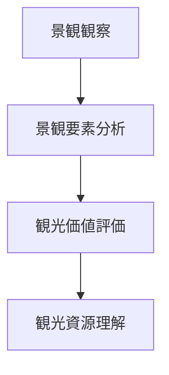

# 観光景観評価

## 概要

観光景観評価とは  
**景観の観光価値を分析・評価する方法**である。

観光景観は

- 視覚的魅力
- 象徴性
- 体験価値

などによって評価される。

この評価により

- 観光資源
- 観光ポテンシャル

を理解できる。

---

# 観光景観の基本構造

---

# 観光景観の評価要素

## 視覚魅力

景観の美しさ。

例

- 山景観
- 河岸景観
- 歴史景観

---

## 象徴性

都市や地域を象徴する景観。

例

- 城
- 神社
- タワー

---

## 歴史性

歴史的背景。

例

- 城下町
- 宿場町

---

## 体験価値

観光体験としての魅力。

例

- 散策
- 景観鑑賞
- 写真

---

# 観光景観評価の手順

---

# フィールドワーク質問

1 景観は美しいか  
2 景観は地域を象徴しているか  
3 観光体験として魅力があるか  
4 写真スポットになりうるか  

---

# 例

### 京都東山

景観

寺社景観

評価

高い観光景観価値

---

### 金沢

景観

城下町景観

評価

歴史景観価値

---

### 地方都市

景観

商店街

評価

生活景観中心

---

# 分析の目的

観光景観評価の目的は以下である。

- 観光資源理解  
- 観光価値評価  
- 観光開発分析  

---

# 関連ノート

- [[景観分析フレーム]]
- [[景観要素分解]]
- [[ランドマーク分析]]
- [[観光動線分析]]