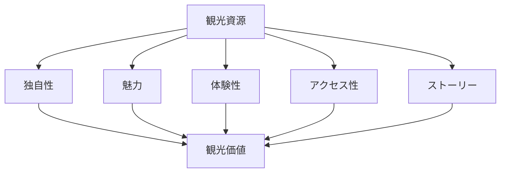
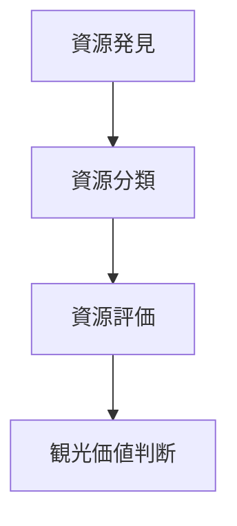

# 観光資源評価フレーム

## 概要

観光資源評価フレームとは  
**観光資源の価値や魅力度を体系的に評価するためのフレームワーク**である。

観光地には多くの資源が存在するが、  
すべてが観光価値を持つわけではない。

観光資源を評価するためには以下の要素を考える。

- 独自性
- 視覚的魅力
- 体験性
- アクセス性
- ストーリー性

これらを総合的に評価することで  
観光資源の価値を判断できる。

---

## 観光資源評価の基本構造

---

## 評価要素

### 独自性

他の場所にはない特徴。

例

- 世界遺産
- 特殊地形
- 歴史的事件

独自性が高いほど観光価値は高い。

---

### 視覚的魅力

景観の魅力。

例

- 美しい景観
- 印象的な建築
- パノラマ

視覚的魅力は観光動機を生む。

---

### 体験性

観光客が体験できる内容。

例

- 散策
- 体験活動
- 食文化

体験が観光満足を高める。

---

### アクセス性

観光客の訪れやすさ。

例

- 駅
- 駐車場
- 交通

アクセスが悪いと観光価値は低下する。

---

### ストーリー性

観光資源の意味。

例

- 歴史
- 人物
- 文化

ストーリーは観光価値を強化する。

---

## 観光資源評価のプロセス

---

## フィールドワークでの質問

観光資源を見るときは次を考える。

1 この資源は何か  
2 この資源は独自か  
3 この資源は魅力的か  
4 この資源は体験できるか  
5 この資源には物語があるか  

---

## 例

### 兼六園

独自性

- 日本三名園

魅力

- 庭園景観

体験

- 散策

ストーリー

- 加賀藩庭園

観光価値

**高い**

---

### 武家屋敷

独自性

- 武家文化

魅力

- 歴史建築

体験

- 街歩き

ストーリー

- 城下町文化

観光価値

**高い**

---

## 観光資源評価の目的

このフレームの目的は以下である。

- 観光資源発見  
- 観光資源評価  
- 観光地設計  

---

## 関連ノート

- [[観光価値]]
- [[観光地分析フレーム]]
- [[都市アイデンティティ]]
- [[観光動線設計フレーム]]