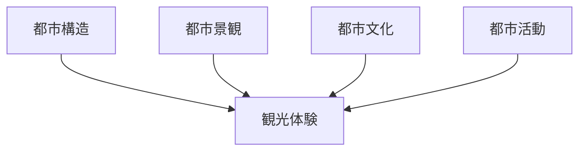
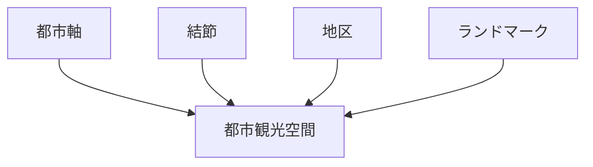
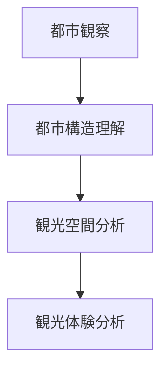
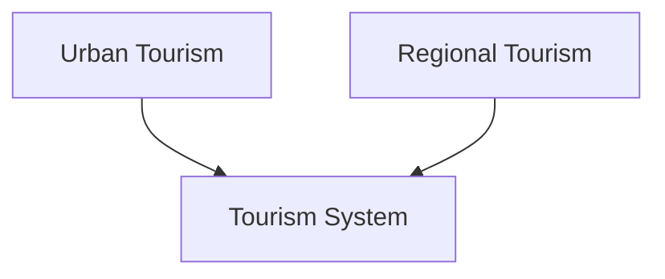

# Urban Tourism Analysis（都市観光分析）

## 概要

都市観光分析とは  
**都市構造・都市景観・都市文化を分析し、都市観光資源と都市体験を理解する方法**である。

都市観光では

- 都市構造
- 景観
- 文化
- 活動

が観光体験を形成する。

---

# 都市観光の基本構造



---

# 都市観光資源

| 要素 | 内容 |
|---|---|
| 歴史資源 | 城・町並み |
| 景観資源 | 街路・河川景観 |
| 文化資源 | 神社・祭礼 |
| 商業資源 | 商店街・市場 |
| 娯楽資源 | 文化施設 |

---

# 都市観光フレーム



---

# 都市観光空間

都市観光では

- 観光軸
- 観光結節
- 観光地区

が形成される。

例

- 観光ストリート
- 観光広場
- 観光地区

---

# フィールドワーク質問

1 観光客はどこを歩くか  
2 都市の観光軸はどこか  
3 観光結節はどこか  
4 都市の象徴は何か  

---

# 都市観光の例

## 城下町観光

```
城
↓
武家地
↓
町人地
↓
観光地区
```

例

- 金沢
- 松本

---

## 港町観光

```
港
↓
旧居留地
↓
商業地区
↓
観光地区
```

例

- 神戸
- 長崎

---

## 文化都市観光

```
寺院
↓
町並み
↓
文化施設
↓
観光都市
```

例

- 京都
- 奈良

---

# 都市観光分析の流れ



---

# 都市観光と地域観光



都市観光と地域観光は  
観光システムを構成する。

---

# 関連ノート

- [[都市構造分析]]
- [[Regional Tourism Analysis Hub]]
- [[観光景観評価]]
- [[都市比較フレーム]]