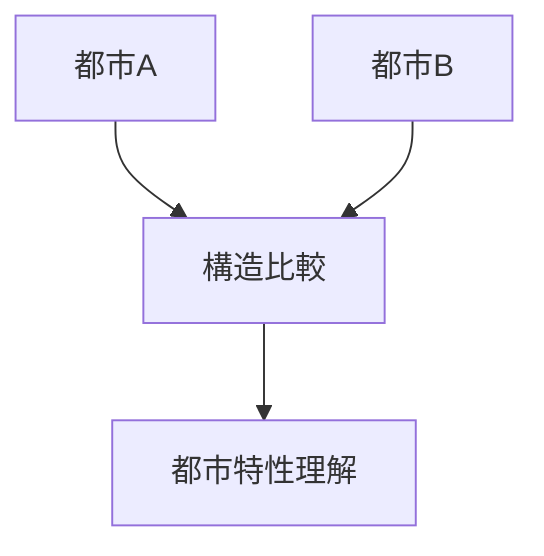
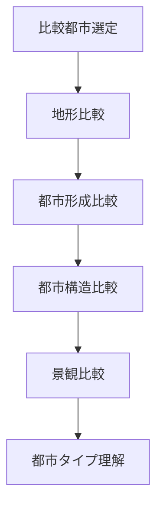

# 都市比較フレーム

## 概要

都市比較フレームとは  
**複数の都市を比較して都市構造や都市特性を理解する方法**である。

都市は

- 地形
- 歴史
- 経済
- 都市計画

によって異なる。

比較によって

- 共通構造
- 都市タイプ
- 都市形成

を理解できる。

---

# 都市比較の基本構造

---

# 比較要素

## 地形

都市立地を比較する。

確認すること

- 山
- 河川
- 段丘
- 海岸

例

- 京都（盆地）
- 長崎（斜面）

---

## 都市形成

都市成立の背景を比較する。

例

- 城下町
- 港町
- 宿場町
- 門前町

---

## 都市構造

都市内部構造を比較する。

確認すること

- 街路
- 街区
- 都市中心

関連ノート

- [[街区分析]]
- [[都市軸分析]]

---

## 景観

景観構造を比較する。

確認すること

- ランドマーク
- 景観軸
- 河岸景観

関連ノート

- [[景観分析フレーム]]

---

## 観光

観光資源を比較する。

確認すること

- 観光地
- 観光動線
- 観光景観

関連ノート

- [[観光動線分析]]

---

# 都市比較の手順

---

# フィールドワーク質問

1 都市の立地はどう違うか  
2 都市形成は何が違うか  
3 都市構造はどう違うか  
4 景観はどう違うか  

---

# 例

### 京都 vs 金沢

地形

京都

盆地

金沢

河岸段丘

都市形成

京都

古代都

金沢

城下町

---

### 長崎 vs 神戸

地形

長崎

斜面都市

神戸

海岸都市

都市形成

長崎

港町

神戸

港湾都市

---

# 分析の目的

都市比較の目的は以下である。

- 都市特性理解  
- 都市タイプ理解  
- 観光都市理解  

---

# 関連ノート

- [[地図読解法]]
- [[古地図比較]]
- [[都市構造分析フレーム]]
- [[景観分析フレーム]]