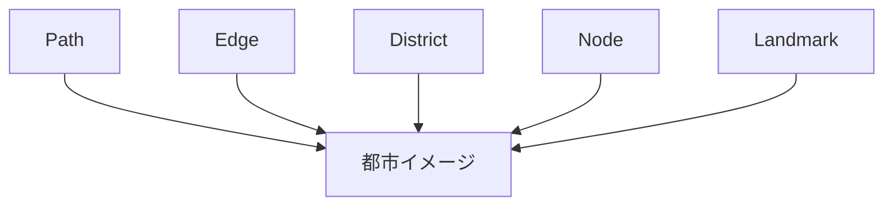
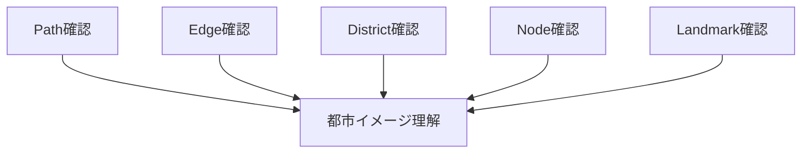

# 都市イメージ分析

## 概要

都市イメージ分析とは  
**人が都市をどのように認識し記憶しているかを分析する方法**である。

この理論は都市研究者

Kevin Lynch

の著書

The Image of the City

で提唱された。

都市イメージは次の5要素によって構成される。

- Path
- Edge
- District
- Node
- Landmark

---

# 都市イメージの基本構造

---

# 都市イメージの5要素

## Path（経路）

人が移動する経路。

例

- 道路
- 通り
- 散策路
- 鉄道

観察ポイント

- 人の流れ
- 観光動線

関連ノート

- [[観光動線分析]]

---

## Edge（境界）

都市の境界。

例

- 河川
- 鉄道
- 崖
- 城壁

観察ポイント

- 地区の分断
- 景観変化

---

## District（地区）

都市の特徴的な地区。

例

- 商業地区
- 住宅地区
- 観光地区

観察ポイント

- 土地利用
- 建築

関連ノート

- [[土地利用分析]]

---

## Node（結節点）

人が集まる場所。

例

- 駅
- 広場
- 交差点
- 観光地

観察ポイント

- 人の集中
- 活動

---

## Landmark（ランドマーク）

目印となる場所。

例

- 城
- タワー
- 寺社

観察ポイント

- 視認性
- 象徴性

関連ノート

- [[ランドマーク分析]]

---

# 都市イメージ分析の手順

---

# フィールドワーク質問

1 人はどの道を使うか  
2 地区の境界はどこか  
3 地区の特徴は何か  
4 人が集まる場所はどこか  
5 都市の象徴は何か  

---

# 例

### 京都

Path

四条通

Edge

鴨川

District

祇園

Node

四条河原町

Landmark

清水寺

---

### 金沢

Path

香林坊通り

Edge

犀川  
浅野川

District

長町

Node

近江町市場

Landmark

金沢城

---

# 分析の目的

都市イメージ分析の目的は以下である。

- 都市認知理解  
- 都市構造理解  
- 観光動線理解  

---

# 関連ノート

- [[ランドマーク分析]]
- [[街区分析]]
- [[観光動線分析]]
- [[景観要素分解]]