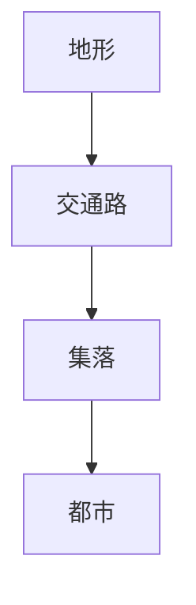
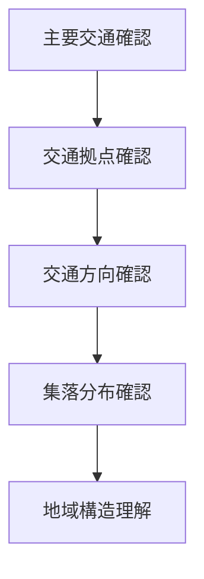

# 地域交通観察

## 概要

地域交通観察とは  
**地域の交通路と交通拠点を観察し、地域構造を理解する方法**である。

交通は

- 人
- 物流
- 情報

を運び、地域の形成に強く影響する。

交通路を観察すると

- 地域中心
- 集落分布
- 経済活動

を理解できる。

---

# 交通構造

地形が交通路を決め  
交通路が集落を生む。

---

# 交通の種類

## 街道

特徴

- 歴史的交通路
- 宿場町形成

例

- 東海道
- 北陸街道

---

## 鉄道

特徴

- 駅中心都市
- 工業発展

例

- 東海道本線
- 山陽本線

---

## 道路

特徴

- 自動車交通
- 郊外発展

例

- 国道
- 高速道路

---

## 港

特徴

- 海上交通
- 貿易都市

例

- 神戸港
- 長崎港

---

# 観察方法

---

# フィールドワーク質問

1 この地域の主要交通は何か  
2 交通はどこを通るか  
3 交通拠点はどこか  
4 集落は交通沿いにあるか  

---

# 観察ポイント

- 街道
- 鉄道
- 駅
- 港
- 交通分岐

---

# 分析の目的

地域交通観察の目的は

- 地域導線理解
- 集落形成理解
- 経済活動理解

である。

---

# 関連ノート

- [[地域地形観察]]
- [[交通観察]]
- [[都市形成プロセス分析]]
- [[地域集落観察]]