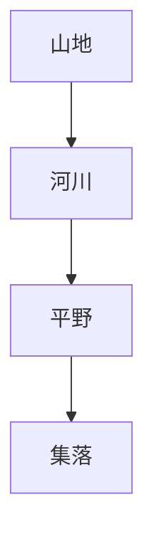
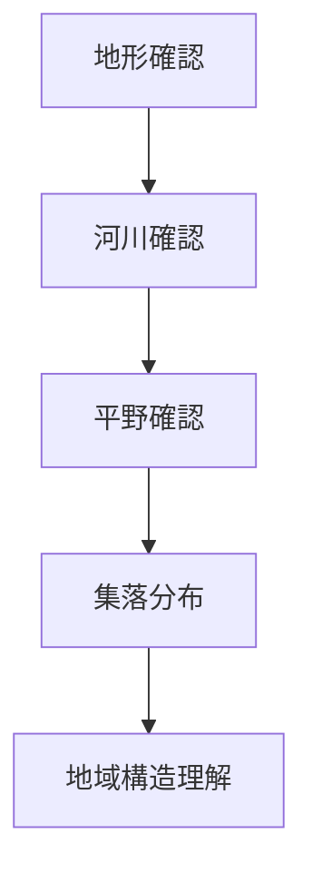

# 地域地形観察

## 概要

地域地形観察とは  
**地域の地形構造を観察し、人間活動との関係を理解する方法**である。

地域の地形は

- 集落立地
- 交通路
- 産業
- 景観

を強く規定する。

地形を理解すると  
地域構造の基礎を理解できる。

---

# 地形の基本構造

地形は  
**水と人の流れを規定する。**

---

# 主な地形

## 山地

特徴

- 森林
- 林業
- 山村

例

- 飛騨山地
- 紀伊山地

---

## 平野

特徴

- 農業
- 都市
- 交通

例

- 関東平野
- 濃尾平野

---

## 盆地

特徴

- 城下町
- 内陸都市

例

- 京都盆地
- 甲府盆地

---

## 海岸

特徴

- 港
- 漁業
- 貿易

例

- 瀬戸内海沿岸
- 日本海沿岸

---

# 観察方法

---

# フィールドワーク質問

1 この地域の基本地形は何か  
2 河川はどこを流れるか  
3 平野はどこに広がるか  
4 集落はどこに立地するか  

---

# 観察ポイント

- 山地
- 平野
- 河川
- 海岸
- 盆地

---

# 分析の目的

地域地形観察の目的は

- 地域立地理解
- 集落立地理解
- 交通構造理解

である。

---

# 関連ノート

- [[河川観察]]
- [[都市立地観察]]
- [[都市形成プロセス分析]]
- [[地域交通観察]]