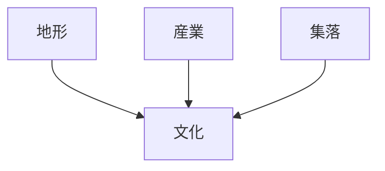
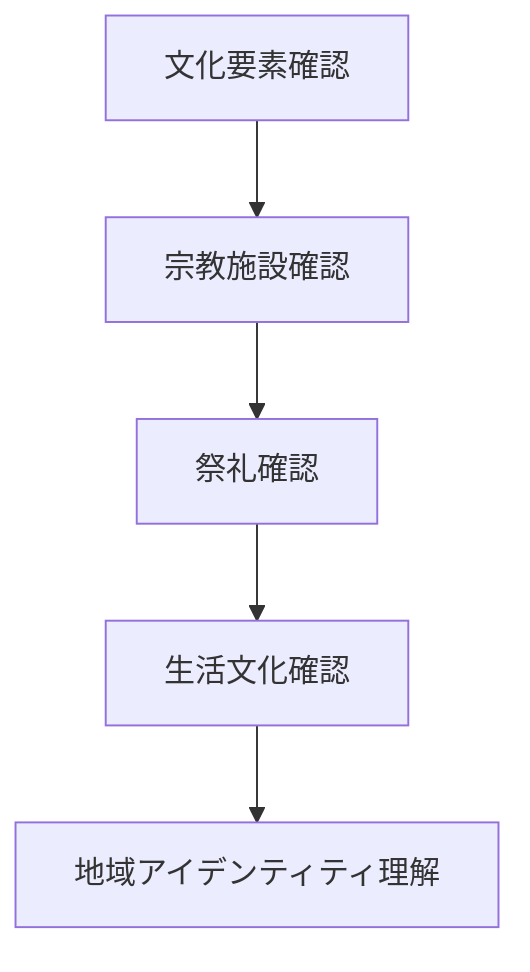

# 地域文化観察

## 概要

地域文化観察とは  
**地域における文化・宗教・生活様式を観察し、地域の歴史とアイデンティティを理解する方法**である。

文化は

- 地形
- 交通
- 産業
- 集落

の影響を受けて形成される。

文化を観察すると

- 地域の歴史
- 生活様式
- 地域アイデンティティ

を理解できる。

---

# 文化形成の基本構造

文化は  
**地域環境と人間活動の結果**として生まれる。

---

# 主な文化要素

## 宗教

例

- 神社
- 寺院
- 聖地

特徴

地域信仰。

---

## 祭礼

例

- 地域祭り
- 神事

特徴

地域共同体。

---

## 景観文化

例

- 町並み
- 建築様式

特徴

地域美意識。

---

## 食文化

例

- 郷土料理
- 地元食材

特徴

地域産業と関係。

---

## 生活文化

例

- 生活習慣
- 民俗

特徴

地域社会。

---

# 観察方法

---

# フィールドワーク質問

1 この地域の象徴的文化は何か  
2 宗教施設はどこにあるか  
3 祭礼はどのように行われるか  
4 文化と産業の関係は何か  

---

# 観察ポイント

- 神社
- 寺院
- 町並み
- 祭礼
- 郷土料理

---

# 分析の目的

地域文化観察の目的は

- 地域アイデンティティ理解
- 地域歴史理解
- 観光資源理解

である。

---

# 関連ノート

- [[地域集落観察]]
- [[地域産業観察]]
- [[観光景観評価]]
- [[都市形成プロセス分析]]