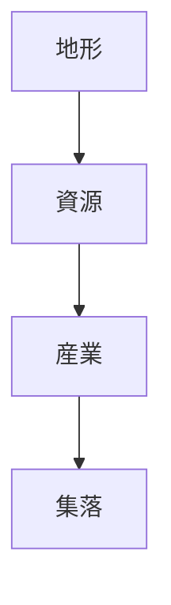
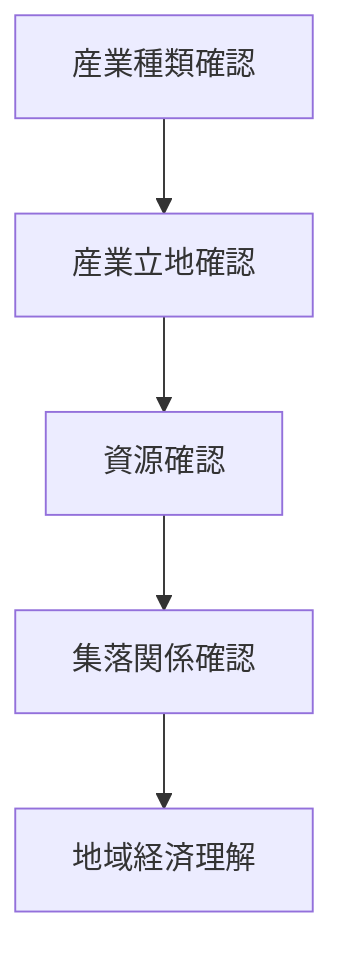

# 地域産業観察

## 概要

地域産業観察とは  
**地域の産業構造を観察し、地域経済と集落形成の関係を理解する方法**である。

地域の産業は

- 地形
- 気候
- 交通

と強く関係する。

産業を観察すると

- 地域経済
- 集落形成
- 景観

を理解できる。

---

# 産業形成の基本構造

地形と資源が  
地域産業を生む。

---

# 主な産業

## 農業

特徴

- 平野
- 扇状地
- 水資源

例

- 水田農業
- 果樹農業
- 畑作

---

## 漁業

特徴

- 海岸
- 漁港

例

- 沿岸漁業
- 遠洋漁業

---

## 林業

特徴

- 山地
- 森林

例

- 木材生産
- 山村経済

---

## 工業

特徴

- 交通
- 労働力
- 都市

例

- 工業団地
- 港湾工業

---

## 観光

特徴

- 景観
- 歴史
- 文化

例

- 観光地
- 温泉地

---

# 観察方法

---

# フィールドワーク質問