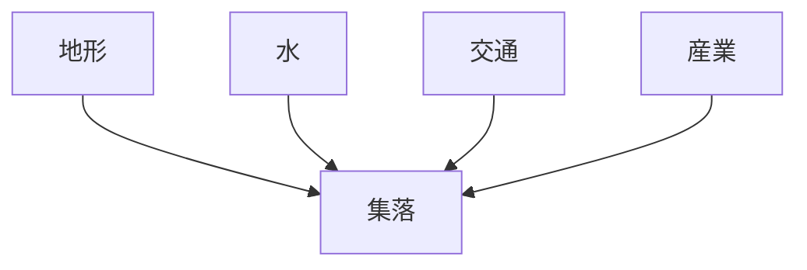
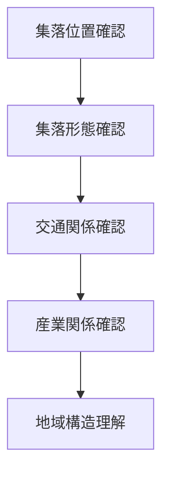

# 地域集落観察

## 概要

地域集落観察とは  
**地域における人間の居住形態と分布を観察し、地域構造を理解する方法**である。

集落は

- 地形
- 水
- 交通
- 産業

によって形成される。

集落を観察すると

- 地域の歴史
- 経済
- 生活

を理解できる。

---

# 集落形成の基本構造

集落は  
**自然条件と経済条件の交点**に形成される。

---

# 主な集落形態

## 村落

特徴

- 農業中心
- 小規模

例

- 農村
- 山村

---

## 宿場町

特徴

- 街道沿い
- 交通拠点

例

- 中山道宿場町
- 東海道宿場町

---

## 港町

特徴

- 海上交通
- 貿易

例

- 長崎
- 函館

---

## 城下町

特徴

- 政治中心
- 城郭都市

例

- 金沢
- 松本

---

## 門前町

特徴

- 宗教中心
- 参拝者経済

例

- 伊勢
- 高野山

---

# 観察方法

---

# フィールドワーク質問

1 集落はどこに立地するか  
2 集落は何を中心に形成されたか  
3 交通との関係は何か  
4 産業との関係は何か  

---

# 観察ポイント

- 村落
- 宿場町
- 港町
- 城下町
- 門前町

---

# 分析の目的

地域集落観察の目的は

- 地域居住構造理解
- 地域形成理解
- 地域歴史理解

である。

---

# 関連ノート

- [[地域地形観察]]
- [[地域交通観察]]
- [[地域産業観察]]
- [[地域文化観察]]