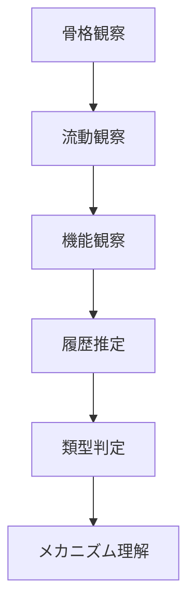

# Urban Fieldwork Observation Protocol

都市や地域を短時間で理解するための観察手順。

目的は

**街の支配構造を特定すること**

である。

---

# 全体プロセス



---

# STEP 1 骨格観察（Spatial Skeleton）
最初に街の骨格を掴みます。
これは街の「地形＋交通＋中心」です。
## 見るもの
- 駅
- 幹線道路
- 川
- 港
- 商業核
- 行政核
- 住宅地
## 自問
- この街の中心はどこか
- 人が集まる場所はどこか
- 地形はどう制約しているか
## 典型骨格鉄道中心都市
- 港湾都市 
- 街道都市
- 工場都市
- 観光都市
- 郊外拡散都市

# STEP 2 流動観察（Flow）
次に人と車の流れを見ます。
## 見るもの
- 歩行者流
- 車流
- バス動線
- 自転車流
## 観察ポイント
- どこで人が滞留するか
- どこは通過空間か
- 車優位か歩行優位か
## 例
- 駅 → 商店街 → 住宅地
- 港 → 市場 → 飲食
- 幹線道路 → 郊外店舗
# STEP 3 機能観察（Urban Function）
次に空間の役割を見る。
## 機能の種類
- 商業
- 行政
- 住宅
- 観光
- 産業
- 教育
## 観察
- 商業核はどこか
- 生活核はどこか
- 観光核はどこか
## 重要
- 多くの都市では生活核 ≠ 観光核
# STEP 4 履歴推定（Historical Layer）
街の形は歴史の結果です。
## 推定ポイント
- 道路幅
- 建物年代
- 駅位置
- 河川
- 港
- 城跡
## ,自問
- この街はいつ拡張したか
- 鉄道以前の街か
- モータリゼーション期の拡張か
# STEP 5 類型判定（City Type）
ここで街を型に当てる。
## 機能類型
### 1 水辺景観
水と都市の関係。

|類型|説明|例|
|---|---|---|
|水都|水路が都市構造|ヴェネツィア、大阪|
|運河都市|運河交通が発達|アムステルダム、倉敷|
|河岸都市|河川沿いに街形成|パリ、京都|
|港町景観|港湾中心の都市景観|ナポリ、長崎|
|海岸都市|海岸線に沿う|バルセロナ、鎌倉|
|湖畔都市|湖岸景観|チューリッヒ、諏訪|
|河口都市|河口デルタ都市|上海、大阪|
|水路都市|水路網が街区形成|蘇州、柳川|
|桟橋都市|桟橋が街の一部|ブライトン、熱海|
|運河住宅都市|運河沿い住宅|ブルージュ、倉敷|

### 2 地形景観
都市と地形。

|類型|説明|例|
|---|---|---|
|坂の街|坂道景観|サンフランシスコ、長崎|
|階段都市|階段路地|バルパライソ、尾道|
|丘陵都市|丘陵地形都市|リスボン、長崎|
|山岳都市|山岳地形都市|インスブルック、松本|
|峡谷都市|峡谷沿い都市|グラナダ、黒部|
|高原都市|高原地形都市|クスコ、軽井沢|
|盆地都市|盆地都市|京都、甲府|
|火山都市|火山地形都市|ナポリ、鹿児島|
|崖都市|崖地形都市|マナローラ、下田|
|段丘都市|河岸段丘都市|プラハ、会津若松|
###  3 街路景観
都市の道路構造。

|類型|説明|例|
|---|---|---|
|格子都市|碁盤目街路|ニューヨーク、札幌|
|放射都市|中心から放射|パリ、東京|
|放射環状都市|放射＋環状|モスクワ、東京|
|線状都市|軸線都市|香港、横浜|
|路地都市|路地密集|マラケシュ、京都|
|市場街路都市|市場通り中心|イスタンブール、高山|
|商店街都市|商店街が中心|ミラノ、大阪|
|アーケード都市|商店街アーケード|トリノ、高松|
|歩行者都市|車制限街|フィレンツェ、鎌倉|
|広場都市|広場中心都市|マドリード、札幌|
### 4 建築景観
建築様式。

|類型|説明|例|
|---|---|---|
|歴史建築都市|歴史建築群|ローマ、奈良|
|城郭都市|城を中心|カルカソンヌ、姫路|
|木造町並み|木造建築|京都、高山|
|石造都市|石造建築|フィレンツェ、長崎|
|白壁都市|白壁町並み|オビドス、倉敷|
|赤レンガ都市|レンガ建築|リバプール、横浜|
|高層都市|高層ビル景観|ドバイ、東京|
|モダニズム都市|近代建築|ブラジリア、広島|
|近未来都市|ハイテク建築|シンガポール、豊洲|
|工業建築都市|工場建築景観|ルール地方、北九州|
### 5 商業景観
商業中心景観。

|類型|説明|例|
|---|---|---|
|市場都市|市場中心|マラケシュ、高山|
|バザール都市|中東型市場|イスタンブール、神戸|
|商店街都市|商店街中心|ソウル、大阪|
|商業広場都市|広場市場|プラハ、松本|
|港商業都市|港貿易|シンガポール、横浜|
|百貨店都市|百貨店文化|パリ、東京|
|屋台都市|屋台文化|バンコク、福岡|
|夜市都市|夜市文化|台北、那覇|
|モール都市|ショッピングモール|ドバイ、幕張|
|金融街都市|金融街景観|ニューヨーク、東京|
### 6 文化景観
文化要素。

|類型|説明|例|
|---|---|---|
|宗教都市|宗教中心|メッカ、伊勢|
|巡礼都市|巡礼地|サンティアゴ、熊野|
|祭礼都市|祭礼文化|セビリア、京都|
|学園都市|大学都市|オックスフォード、つくば|
|芸術都市|芸術中心|フィレンツェ、金沢|
|温泉都市|温泉文化|バーデン、別府|
|リゾート都市|観光休養|ニース、軽井沢|
|遺産都市|世界遺産都市|ローマ、奈良|
|文化保存都市|町並み保存|ブルージュ、白川郷|
|音楽都市|音楽文化|ウィーン、浜松|
## 7 都市機能景観
都市機能が景観に現れるタイプ。

|類型|説明|例|
|---|---|---|
|港湾都市|港湾景観|ロッテルダム、神戸|
|空港都市|空港中心|ドバイ、成田|
|鉄道都市|鉄道拠点|シカゴ、大宮|
|工業都市|工場景観|デトロイト、北九州|
|IT都市|ハイテク都市|サンノゼ、渋谷|
|行政都市|官庁街|ワシントン、東京|
|軍事都市|軍港都市|サンディエゴ、横須賀|
|物流都市|物流拠点|メンフィス、成田|
|観光都市|観光景観|ヴェネツィア、京都|
|学研都市|研究施設|ケンブリッジ、つくば|

 ## 例 
 
# STEP 6 メカニズム理解
最後に、何が街を動かしているかを考える。
## 典型メカニズム
- 鉄道通勤
- 自動車依存
- 観光
- 工業
- 港湾物流
- 行政
# 最終アウトプット
街を次の形でまとめる。
- 都市骨格
- 主流動
- 機能配置
- 歴史層
- 都市類型
- 支配メカニズム


---

---

# 実例（簡易）

例えば地方都市を観察すると：

### 骨格

```
駅 + 幹線道路
```

### 流動

```
駅前は通過
郊外幹線に車集中
```

### 機能

```
駅前：行政
郊外：商業
```

### 履歴

```
1970年代モータリゼーション
```

### 類型

```
郊外拡散都市
```

### メカニズム

```
自動車依存
```