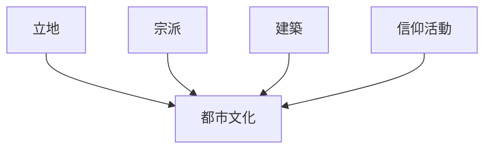
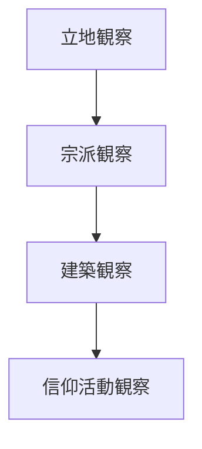

# 宗教施設観察チェックリスト

## 概要

宗教施設観察チェックリストとは  
**神社・寺院・教会などの宗教施設を観察する際に確認すべき要素を整理したチェックリスト**である。

宗教施設は

- 都市成立
- 歴史
- 地域文化
- 観光

と深く結びついている。

多くの都市では

宗教施設 → 都市形成

という関係が見られる。

---

## 宗教施設観察の基本構造

---

## 1 立地

宗教施設の位置を観察する。

観察項目

- 山
- 川沿い
- 都市中心
- 都市外縁

確認するポイント

- 都市成立との関係
- 防御
- 景観

---

## 2 宗派

宗教施設の宗派を観察する。

観察項目

- 神社
- 仏教寺院
- キリスト教会

確認するポイント

- 宗派分布
- 歴史背景

---

## 3 建築

宗教施設の建築を観察する。

観察項目

- 本殿
- 山門
- 塔
- 境内

確認するポイント

- 建築様式
- 規模

---

## 4 信仰活動

宗教施設で行われる活動を観察する。

観察項目

- 参拝
- 祭り
- 行事

確認するポイント

- 地域との関係
- 観光化

---

## 宗教施設タイプ

代表的な宗教施設。

### 神社

特徴

- 地域守護
- 祭礼

例

- 伊勢神宮
- 八坂神社

---

### 仏教寺院

特徴

- 宗派
- 修行

例

- 東大寺
- 清水寺

---

### 教会

特徴

- 近代宗教施設

例

- 長崎教会群

---

## 宗教施設観察の順序

---

## フィールドワークでの質問

宗教施設を見るときは次を考える。

1 なぜここにあるのか  
2 どの宗派か  
3 どんな建築か  
4 地域とどう関係しているか  

---

## 例

### 京都

立地

- 山麓
- 都市中心

宗派

- 仏教
- 神道

建築

- 寺院建築

信仰活動

- 観光
- 祭礼

---

### 金沢

立地

- 寺町台地

宗派

- 仏教

建築

- 寺院群

信仰活動

- 地域信仰
- 観光

---

## 宗教施設観察の目的

このチェックリストの目的は以下である。

- 都市成立理解  
- 歴史理解  
- 文化理解  

---

## 関連ノート

- [[02_zettelkasten/01_knowledge/domain/fieldwork_tourism/04_method/07_observation/05_urban_observation/都市観察チェックリスト]]
- [[建築観察チェックリスト]]
- [[都市レイヤー]]
- [[観光資源評価フレーム]]