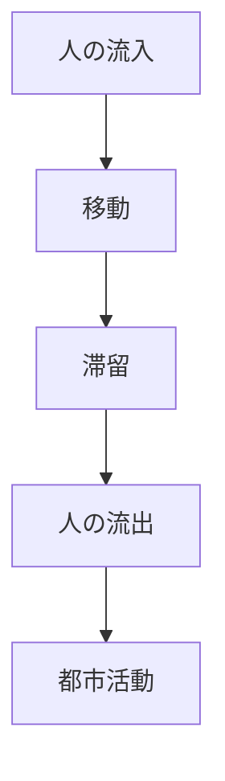
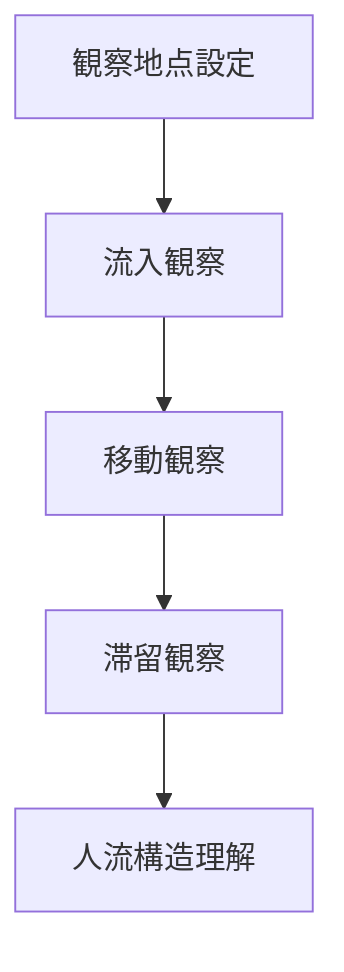

# 人流観察

## 概要

人流観察とは  
**都市空間における人の移動と滞留を観察する方法**である。

都市では

- 人の流れ
- 人の集中
- 人の滞留

によって都市機能が形成される。

人流を観察することで

- 都市中心
- 商業活動
- 観光動線

を理解できる。

---

# 人流の基本構造

---

# 観察項目

## 人の流入

どこから人が来るか。

例

- 駅
- バス停
- 駐車場

観察ポイント

都市入口。

---

## 移動

人がどの道を通るか。

例

- 大通り
- 商店街
- 観光通り

観察ポイント

主要動線。

---

## 滞留

人が集まる場所。

例

- 広場
- 店舗前
- 観光地

観察ポイント

都市ノード。

---

## 流出

人がどこへ向かうか。

例

- 駅
- 観光地
- 商業地区

---

# 人流観察の方法

---

# フィールドワーク質問

1 人はどこから来るか  
2 人はどの道を通るか  
3 人はどこに集まるか  
4 人はどこへ向かうか  

---

# 観察ポイント

- 人の流れの方向  
- 混雑地点  
- 滞留地点  
- 観光客と地元住民の違い  

---

# 例

### 観光地

人流

駅 → 商店街 → 観光地

特徴

観光動線

---

### 商業地区

人流

駅 → 商業施設 → 飲食店

特徴

滞留地点多い

---

### 住宅地区

人流

駅 → 住宅

特徴

通過型

---

# 分析の目的

人流観察の目的は以下である。

- 都市活動理解  
- 都市中心理解  
- 観光動線理解  

---

# 関連ノート

- [[交通観察チェックリスト]]
- [[観光動線分析]]
- [[都市中心分析]]
- [[都市イメージ分析]]