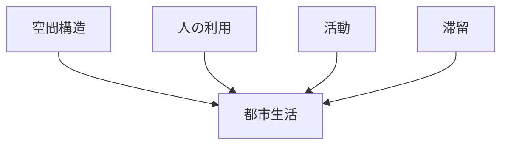

# 公共空間観察

## 概要

公共空間観察とは  
**都市の公共空間がどのように利用されているかを観察する方法**である。

公共空間とは

- 広場
- 公園
- 河岸
- 駅前広場
- 歩行者空間

など  
**誰でも利用できる都市空間**である。

公共空間は

- 交流
- 滞留
- 休憩
- 観光

など都市活動の中心になる。

そのため公共空間を観察すると

- 都市生活
- 都市文化
- 観光行動

を理解できる。

---

# 公共空間の構造

---

# 公共空間の種類

## 広場

例

- 駅前広場
- 都市広場

特徴

- 人流集中
- 待ち合わせ
- イベント

---

## 公園

例

- 都市公園
- 河川公園

特徴

- 休憩
- 散歩
- 子どもの遊び

---

## 河岸空間

例

- 川沿い
- 遊歩道

特徴

- 景観利用
- 散策

---

## 歩行者空間

例

- 歩行者天国
- 商店街