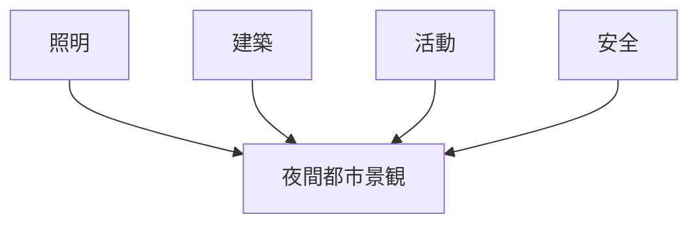
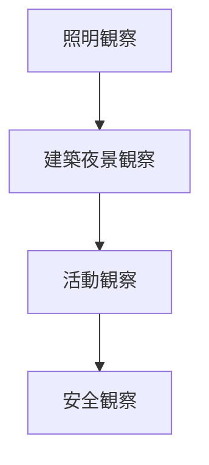

# 夜間景観観察チェックリスト

## 概要

夜間景観観察チェックリストとは  
**夜間における都市景観や活動を観察する際に確認すべき要素を整理したチェックリスト**である。

都市は

昼の都市  
夜の都市  

で性格が大きく変わる。

夜間観察を行うことで

- 夜間景観
- 夜間経済
- 観光活動

を理解することができる。

---

# 夜間景観の基本構造

---

# 1 照明

夜間の照明を観察する。

観察項目

- 街灯
- 店舗照明
- ライトアップ
- ネオン

確認ポイント

- 明るさ
- 色
- 照明分布

---

# 2 建築夜景

夜間の建築景観を観察する。

観察項目

- ライトアップ建築
- 夜景スポット
- シルエット景観

確認ポイント

- ランドマーク
- 夜間景観軸

---

# 3 夜間活動

夜間の人間活動を観察する。

観察項目

- 飲食店
- 居酒屋
- 夜間観光
- 夜市

確認ポイント

- 人の集中
- 活動時間

---

# 4 安全

夜間の安全環境を観察する。

観察項目

- 明るさ
- 人通り
- 警備

確認ポイント

- 安心感
- 犯罪リスク

---

# 夜間景観タイプ

代表的な夜間景観。

### 繁華街型

特徴

- ネオン
- 飲食

例

- 新宿
- 渋谷

---

### 観光夜景型

特徴

- ライトアップ
- 夜景観光

例

- 函館
- 神戸

---

### 静穏型

特徴

- 暗い
- 静かな街

例

- 農村
- 温泉地

---

# 夜間観察の順序

---

# フィールドワークでの質問

夜の街を見るときは次を考える。

1 夜の中心はどこか  
2 照明はどこに集中しているか  
3 人はどこに集まるか  
4 夜の観光資源は何か  

---

# 例

### 京都

夜間景観

- 寺院ライトアップ
- 祇園

夜間活動

- 飲食
- 夜間観光

---

### 金沢

夜間景観

- 茶屋街ライトアップ

夜間活動

- 飲食
- 観光

---

# 夜間景観観察の目的

このチェックリストの目的は以下である。

- 夜間景観理解  
- 夜間経済理解  
- 夜間観光理解  

---

# 関連ノート

- [[景観観察チェックリスト]]
- [[商業観察チェックリスト]]
- [[観光客観察チェックリスト]]
- [[都市レイヤー]]