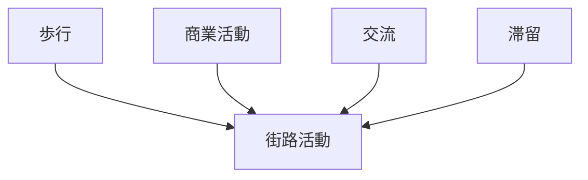
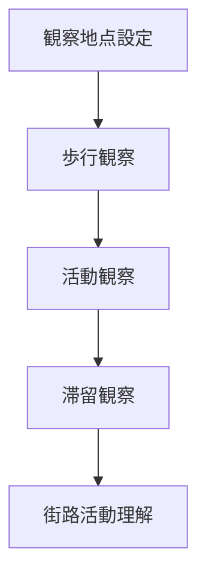

# 街路活動観察

## 概要

街路活動観察とは  
**街路空間で行われている人の活動を観察する方法**である。

都市の街路では

- 歩行
- 商業活動
- 交流

など様々な活動が行われる。

街路活動を観察することで

- 都市の活力
- 商業活動
- 観光活動

を理解できる。

---

# 街路活動の基本構造

---

# 観察項目

## 歩行

人の移動。

例

- 通勤
- 観光
- 買い物

観察ポイント

歩行量。

---

## 商業活動

店舗と客の活動。

例

- 店舗利用
- 屋台
- 露店

観察ポイント

商業活発度。

---

## 交流

人の交流。

例

- 会話
- 集まり
- イベント

観察ポイント

社会活動。

---

## 滞留

人が立ち止まる活動。

例

- 写真撮影
- 休憩
- 観光

観察ポイント

都市ノード。

---

# 観察方法

---

# フィールドワーク質問

1 人は街路で何をしているか  
2 どこで人が立ち止まるか  
3 商業活動はどこで起きているか  
4 人の交流はどこで起きているか  

---

# 観察ポイント

- 人の密度  
- 活動の種類  
- 滞留地点  
- 観光客と地元住民  

---

# 例

### 観光地

活動

- 写真
- 散策
- 食べ歩き

特徴

滞留多い

---

### 商店街

活動

- 買い物
- 会話

特徴

商業中心

---

### 住宅街

活動

- 通過
- 散歩

特徴

滞