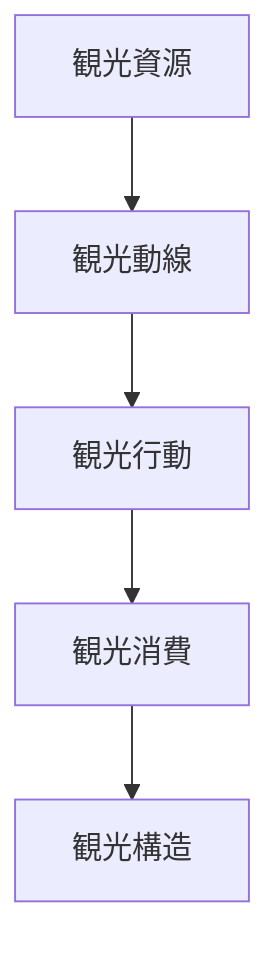
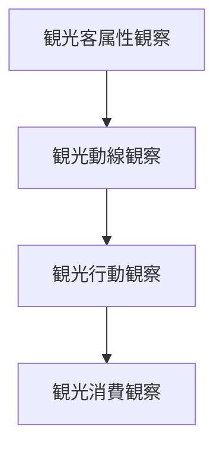

# 観光客観察チェックリスト

## 概要

観光客観察チェックリストとは  
**観光地における観光客の行動や動線を観察する際に確認すべき要素を整理したチェックリスト**である。

観光地では

観光資源 → 観光動線 → 観光行動

という構造が形成される。

観光客の行動を観察することで

- 観光地の魅力
- 観光動線
- 観光消費

を理解することができる。

---

## 観光客観察の基本構造

---

## 1 観光客の属性

観光客の属性を観察する。

観察項目

- 国内観光客
- 外国人観光客
- 個人旅行
- 団体旅行

確認するポイント

- 年齢層
- 国籍
- 旅行形態

---

## 2 観光動線

観光客の移動経路を観察する。

観察項目

- 観光ルート
- 滞在場所
- 移動手段

確認するポイント

- 動線集中
- 人気ルート

---

## 3 観光行動

観光客の行動を観察する。

観察項目

- 写真撮影
- 食事
- 買い物
- 参拝

確認するポイント

- 滞在時間
- 行動パターン

---

## 4 観光消費

観光客の消費を観察する。

観察項目

- 飲食
- 土産
- 体験

確認するポイント

- 消費場所
- 消費規模

---

## 観光客タイプ

代表的な観光客タイプ。

### 観光地巡回型

特徴

- 短時間滞在
- 多地点移動

例

- 団体観光

---

### 滞在型観光

特徴

- 長時間滞在
- 地域体験

例

- 温泉地

---

### 体験型観光

特徴

- 文化体験
- 自然体験

例

- 農村観光

---

## 観光客観察の順序

---

## フィールドワークでの質問

観光客を見るときは次を考える。

1 観光客はどこから来ているか  
2 どこを回っているか  
3 何をしているか  
4 どこでお金を使っているか  

---

## 例

### 京都

観光客属性

- 国内
- 外国人

観光動線

- 清水寺
- 祇園
- 嵐山

観光行動

- 写真
- 食事
- 買い物

観光消費

- 飲食
- 土産

---

### 金沢

観光客属性

- 国内
- 外国人

観光動線

- 兼六園
- 東茶屋街
- 近江町市場

観光行動

- 写真
- 食事

観光消費

- 飲食
- 土産

---

## 観光客観察の目的

このチェックリストの目的は以下である。

- 観光構造理解  
- 観光動線理解  
- 観光消費理解  

---

## 関連ノート

- [[観光資源評価フレーム]]
- [[商業観察チェックリスト]]
- [[交通観察チェックリスト]]
- [[都市レイヤー]]