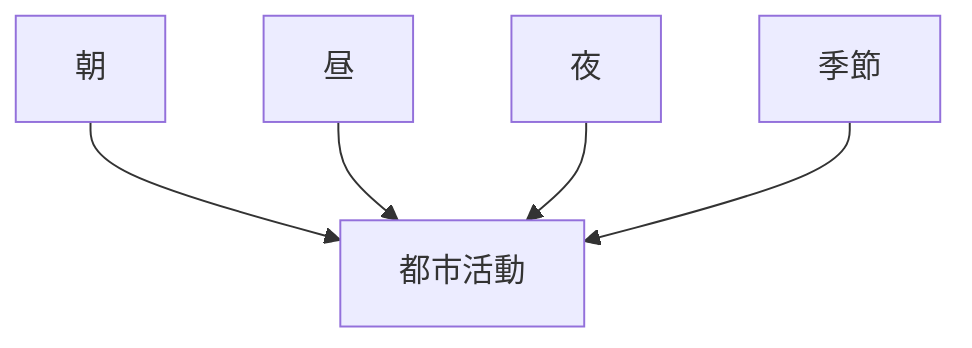
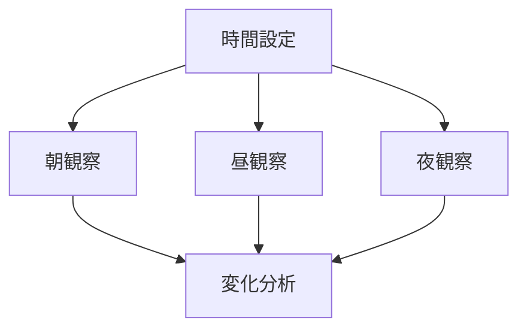

# 都市時間観察

## 概要

都市時間観察とは  
**都市の活動や景観が時間によってどのように変化するかを観察する方法**である。

都市では

- 朝
- 昼
- 夜
- 季節

によって

- 人流
- 活動
- 景観

が大きく変化する。

時間変化を観察することで

- 都市活動
- 商業活動
- 観光活動

を理解できる。

---

# 都市時間構造

---

# 観察項目

## 朝

特徴

- 通勤
- 通学
- 開店準備

観察ポイント

人流の集中。

---

## 昼

特徴

- 商業活動
- 観光
- 交流

観察ポイント

都市活動の中心時間。

---

## 夜

特徴

- 飲食
- 娯楽
- 夜景

観察ポイント

都市の夜間活動。

関連ノート

- [[夜間景観観察]]

---

## 季節

特徴

- 観光シーズン
- イベント

観察ポイント

季節変化。

---

# 観察方法

---

# フィールドワーク質問

1 朝はどんな活動があるか  
2 昼はどんな活動が中心か  
3 夜はどんな場所が活発か  
4 季節で都市はどう変わるか  

---

# 観察ポイント

- 人流変化  
- 活動変化  
- 景観変化  
- 商業変化  

---

# 例

### 商業地区

朝

通勤

昼

買い物

夜

飲食

---

### 観光地

朝

観光客少ない

昼

観光客多い

夜

ライトアップ

---

### 住宅地区

朝

通勤

昼

静か

夜

帰宅

---

# 分析の目的

都市時間観察の目的は以下である。

- 都市活動理解  
- 都市生活理解  
- 観光活動理解  

---

# 関連ノート

- [[人流観察]]
- [[街路活動観察]]
- [[公共空間観察]]
- [[夜間景観観察]]