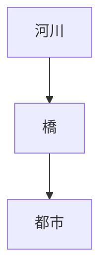
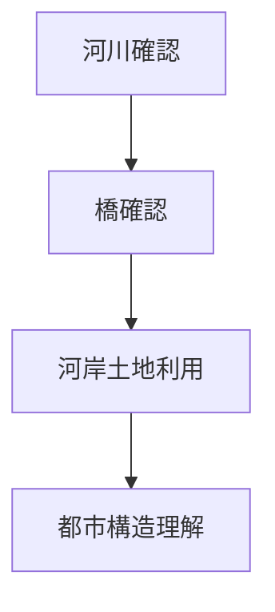

# 河川観察

## 概要

河川観察とは  
**都市と河川の関係を観察する方法**である。

多くの都市は

- 河岸
- 河口
- 橋

など河川と深く関係して形成される。

河川を観察すると

- 都市立地
- 商業活動
- 都市境界

を理解できる。

---

# 河川と都市の基本構造

河川は  
**都市構造を規定する要素**である。

---

# 河川の役割

## 交通

例

- 船運
- 港

特徴

物流。

---

## 境界

例

- 都市境界
- 地区境界

特徴

空間区分。

---

## 景観

例

- 川沿い景観
- 観光景観

特徴

都市イメージ。

---

## 水資源

例

- 飲料水
- 灌漑

特徴

生活基盤。

---

# 観察方法

---

# フィールドワーク質問

1 河川は都市のどこを流れるか  
2 橋はどこにあるか  
3 河岸はどう利用されているか  
4 河川は都市境界か  

---

# 観察ポイント

- 河岸
- 橋
- 港
- 堤防

---

# 分析の目的

河川観察の目的は

- 都市立地理解
- 都市構造理解
- 都市景観理解

である。

---

# 関連ノート

- [[都市立地観察]]
- [[都市高低差観察]]
- [[都市エッジ観察]]
- [[都市形成プロセス分析]]