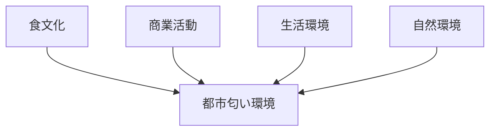

# 匂い環境観察チェックリスト

## 概要

匂い環境観察チェックリストとは  
**都市や地域の匂い環境を観察するためのチェックリスト**である。

匂いは

- 食文化
- 
- 商業
- 生活
- 自然

を反映する。

匂いは

観光体験  
地域印象  

に強い影響を与える。

---

# 匂い環境の基本構造

---

# 1 食文化の匂い

観察項目

- 屋台
- 飲食店

確認ポイント

- 食文化

---

# 2 商業の匂い

観察項目

- 市場
- 商店

確認ポイント

- 商業活動

---

# 3 生活の匂い

観察項目

- 住宅
- 路地

確認ポイント

- 生活感

---

# 4 自然の匂い

観察項目

- 海
- 森
- 川

確認ポイント

- 自然環境

---

# フィールドワーク質問

1 この街の匂いは何か  
2 食文化の匂いはどこか  
3 不快な匂いはあるか  

---

# 目的

- 地域文化理解  
- 観光体験理解  

---

# 関連ノート

- [[商業観察チェックリスト]]
- [[観光資源評価フレーム]]