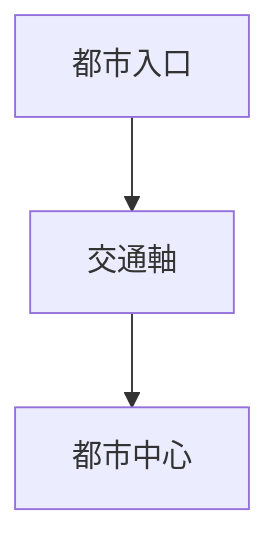
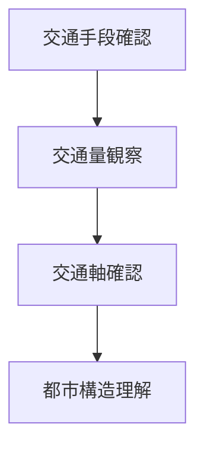

# 交通観察

## 概要

交通観察とは  
**都市における交通の流れと構造を観察する方法**である。

都市では

- 自動車
- 鉄道
- バス
- 自転車
- 歩行

などの交通が都市活動を支える。

交通を観察すると

- 都市の中心
- 都市の導線
- 都市の発展方向

を理解できる。

---

# 交通の基本構造

交通は  
**都市の動線を形成する。**

---

# 交通の種類

## 鉄道交通

例

- 駅
- 鉄道線

特徴

都市中心形成。

---

## 道路交通

例

- 幹線道路
- 高速道路

特徴

都市拡張。

---

## 公共交通

例

- バス
- トラム

特徴

都市内部移動。

---

## 歩行交通

例

- 商店街
- 歩行者空間

特徴

都市活動中心。

---

# 観察方法

---

# フィールドワーク質問

1 この都市の主要交通は何か  
2 人はどこから来るか  
3 交通はどこへ向かうか  
4 都市中心はどこか  

---

# 観察ポイント

- 駅
- 幹線道路
- バスターミナル
- 駐車場

---

# 分析の目的

交通観察の目的は

- 都市導線理解
- 都市中心理解
- 都市活動理解

である。

---

# 関連ノート

- [[人流観察]]
- [[都市入口観察]]
- [[都市軸分析]]
- [[都市構造分析]]