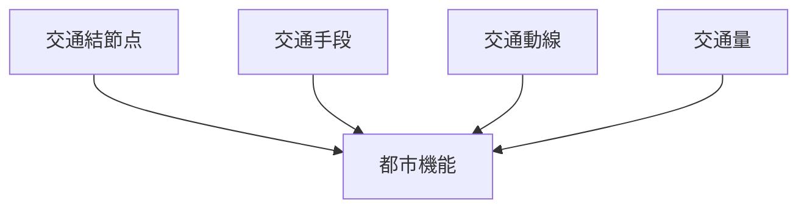
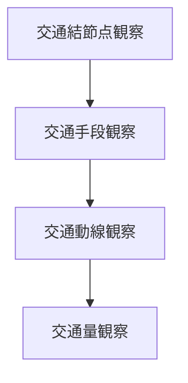

# 交通観察チェックリスト

## 概要

交通観察チェックリストとは  
**都市や地域の交通構造を観察する際に確認すべき要素を整理したチェックリスト**である。

交通は

- 都市構造
- 商業
- 観光
- 人の流れ

を強く反映する。

都市では

交通結節点 → 都市中心

となることが多い。

そのため交通を観察することで

- 都市の実際の中心
- 人の流れ
- 観光動線

を理解することができる。

---

## 交通観察の基本構造

---

## 1 交通結節点

交通が集中する場所を観察する。

観察項目

- 駅
- バスターミナル
- 港
- 空港

確認するポイント

- 人の集中
- 商業集積

---

## 2 交通手段

交通の種類を観察する。

観察項目

- 鉄道
- バス
- 自動車
- 自転車
- 徒歩

確認するポイント

- 主交通手段
- 交通分担

---

## 3 交通動線

人や車の動きを観察する。

観察項目

- 通勤動線
- 観光動線
- 商業動線

確認するポイント

- 動線集中
- 動線方向

---

## 4 交通量

交通の量を観察する。

観察項目

- 歩行者数
- 車両数
- 公共交通利用

確認するポイント

- 混雑
- 活動中心

---

## 交通タイプ

代表的な交通構造。

### 駅中心型

特徴

- 駅前商業
- 人の集中

例

- 日本の都市

---

### 自動車中心型

特徴

- 郊外商業
- 大型駐車場

例

- アメリカ都市

---

### 観光交通型

特徴

- 観光バス
- 観光動線

例

- 京都
- 鎌倉

---

## 交通観察の順序

---

## フィールドワークでの質問

交通を見るときは次を考える。

1 交通の中心はどこか  
2 主な交通手段は何か  
3 人はどこへ向かっているか  
4 交通量はどこで多いか  

---

## 例

### 京都

交通結節点

- 京都駅

交通手段

- 鉄道
- バス

交通動線

- 観光地間移動

交通量

- 観光客多い

---

### 金沢

交通結節点

- 金沢駅

交通手段

- バス
- 徒歩

交通動線

- 観光動線

交通量

- 観光中心

---

## 交通観察の目的

このチェックリストの目的は以下である。

- 都市中心理解  
- 人の流れ理解  
- 観光動線理解  

---

## 関連ノート

- [[02_zettelkasten/01_knowledge/domain/fieldwork_tourism/04_method/07_observation/05_urban_observation/都市観察チェックリスト]]
- [[街路観察チェックリスト]]
- [[観光資源評価フレーム]]
- [[都市レイヤー]]