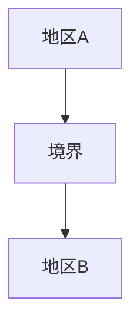
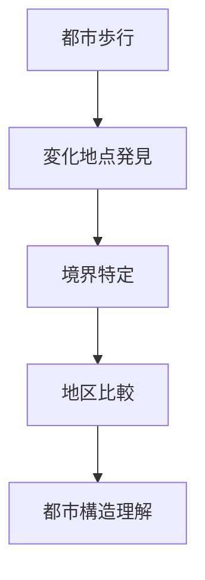

# 境界観察

## 概要

境界観察とは  
**都市の性格が変化する場所を観察する方法**である。

都市には

- 商業地区
- 住宅地区
- 観光地区
- 工業地区

など異なる地区が存在する。

その境界では

- 建築
- 人流
- 景観
- 活動

が大きく変化する。

境界を観察することで  
**都市の構造を理解できる。**

---

# 境界の基本構造

境界は  
**都市構造の切り替え地点**である。

---

# 境界の種類

## 土地利用境界

例

- 商業 → 住宅  
- 工業 → 住宅  

特徴

建物用途が変わる。

---

## 景観境界

例

- 高層 → 低層  
- 近代 → 伝統  

特徴

景観が変化する。

---

## 活動境界

例

- 観光 → 生活  
- 商業 → 住宅  

特徴

人の活動が変わる。

---

## 地形境界

例

- 台地 → 低地  
- 河川  

特徴

地形による区切り。

---

# 観察方法

---

# フィールドワーク質問

1 この場所で街の雰囲気は変わるか  
2 建物の種類は変わるか  
3 人の活動は変わるか  
4 景観は変わるか  

---

# 観察ポイント

- 建築変化  
- 人流変化  
- 店舗変化  
- 景観変化  

---

# 例

### 商業→住宅

特徴

- 店舗減少  
- 人流減少  

---

### 観光→生活

特徴

- 土産店 → 生活店舗  

---

### 新市街→旧市街

特徴

- 高層 → 低層  
- 道路構造変化  

---

# 分析の目的

境界観察の目的は以下である。

- 都市構造理解  
- 地区区分理解  
- 観光地区理解  

---

# 関連ノート

- [[街区分析]]
- [[土地利用分析]]
- [[都市中心分析]]
- [[都市イメージ分析]]