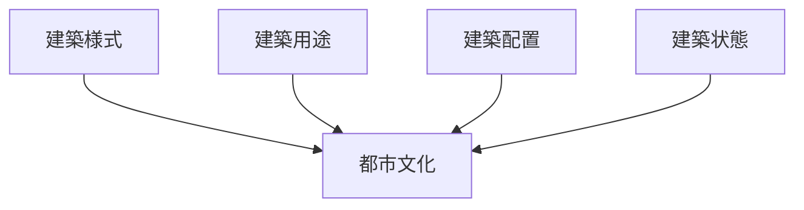
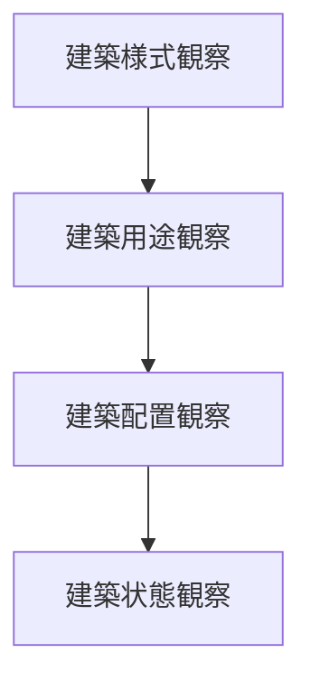

# 建築観察チェックリスト

## 概要

建築観察チェックリストとは  
**都市や地域の建築を観察する際に確認すべき要素を整理したチェックリスト**である。

建築は

- 歴史
- 文化
- 社会構造
- 都市機能

を反映する。

そのため建築を観察することで

- 都市の歴史
- 地域文化
- 観光価値

を理解することができる。

---

## 建築観察の基本構造

---

## 1 建築様式

建物のデザインや形式を観察する。

観察項目

- 伝統建築
- 近代建築
- 現代建築

確認するポイント

- 屋根形状
- 材料
- 装飾

---

## 2 建築用途

建物の用途を観察する。

観察項目

- 住宅
- 商店
- 寺社
- 公共施設

確認するポイント

- 用途の分布
- 用途の集中

---

## 3 建築配置

建物の配置を観察する。

観察項目

- 街路沿い
- 広場周辺
- 集合建築

確認するポイント

- 建物密度
- 空間構造

---

## 4 建築状態

建物の状態を観察する。

観察項目

- 保存
- 改修
- 新築

確認するポイント

- 歴史保存
- 再開発

---

## 建築タイプ

代表的な建築タイプ。

### 町家

特徴

- 商住一体
- 細長い敷地

例

- 京都
- 金沢

---

### 武家屋敷

特徴

- 広い敷地
- 塀

例

- 金沢
- 萩

---

### 寺社建築

特徴

- 宗教施設
- ランドマーク

例

- 京都
- 奈良

---

### 近代建築

特徴

- 石造
- 洋風

例

- 横浜
- 神戸

---

## 建築観察の順序

---

## フィールドワークでの質問

建築を見るときは次を考える。

1 この建物は何の用途か  
2 いつ頃建てられたか  
3 どんな様式か  
4 なぜこの場所にあるのか  

---

## 例

### 京都

建築様式

- 町家
- 寺院建築

建築用途

- 商業
- 宗教

建築配置

- 街路沿い

建築状態

- 保存

---

### 金沢

建築様式

- 武家屋敷
- 茶屋

建築用途

- 住宅
- 観光

建築配置

- 城下町構造

建築状態

- 保存

---

## 建築観察の目的

このチェックリストの目的は以下である。

- 歴史理解  
- 文化理解  
- 観光価値発見  

---

## 関連ノート

- [[景観観察チェックリスト]]
- [[都市レイヤー]]
- [[景観読解]]
- [[観光資源評価フレーム]]