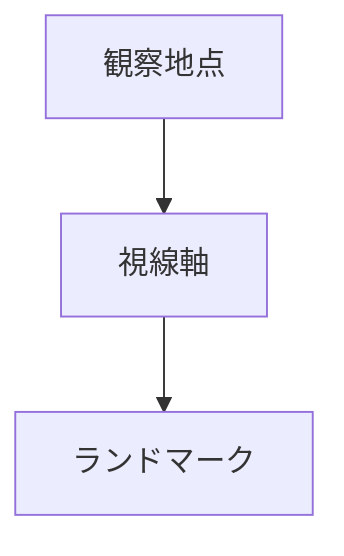
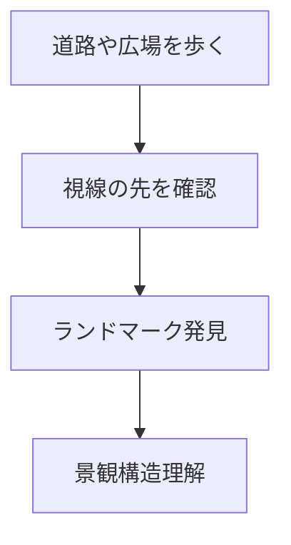

# 視線軸観察

## 概要

視線軸観察とは  
**都市空間において人の視線がどこへ導かれるかを観察する方法**である。

都市では

- 道路
- 広場
- 川
- 建築配置

によって視線が誘導される。

その先には

- 城
- 山
- タワー
- 神社

など都市の象徴が配置されることが多い。

視線軸を観察すると  
**都市景観の構造と象徴性**を理解できる。

---

# 視線軸の基本構造

視線軸は

**都市景観の方向性**

を作る。

---

# 視線軸の種類

## 道路視線軸

例

- 直線道路
- 参道

特徴

道路の延長上にランドマーク。

---

## 河川視線軸

例

- 川沿いの景観
- 橋からの眺望

特徴

水辺景観。

---

## 広場視線軸

例

- 都市広場
- 駅前広場

特徴

広場から象徴建築が見える。

---

## 自然視線軸

例

- 山
- 海

特徴

自然景観への視線。

---

# 観察方法

---

# フィールドワーク質問

1 通りの先に何が見えるか  
2 視線はどこへ導かれるか  
3 ランドマークはどこにあるか  
4 都市は何を見せようとしているか  

---

# 観察ポイント

- 直線道路
- 参道
- 橋
- 広場
- 高所

---

# 例

## 神社参道

視線先

神社

特徴

宗教的景観。

---

## 城下町

視線先

城

特徴

政治中心。

---

## 観光都市

視線先

山やタワー

特徴

象徴景観。

---

# 分析の目的

視線軸観察の目的は

- 景観構造理解
- 都市象徴理解
- 観光景観理解

である。

---

# 関連ノート

- [[ランドマーク分析]]
- [[都市軸分析]]
- [[景観要素分解]]
- [[都市イメージ分析]]