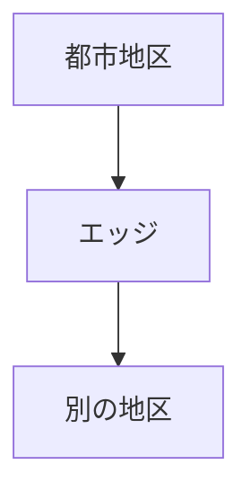
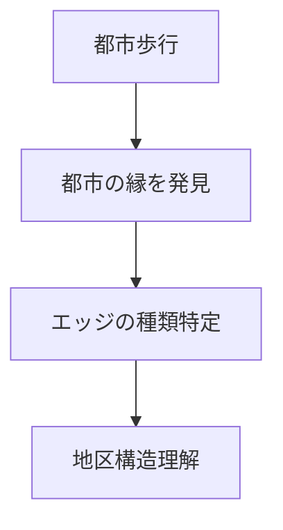

# 都市エッジ観察

## 概要

都市エッジ観察とは  
**都市空間の縁（Edge）を観察する方法**である。

都市のエッジとは  
都市の構造や活動が切り替わる境界である。

例

- 河川
- 崖
- 鉄道
- 高速道路
- 城壁
- 外堀

これらは都市構造を強く規定する。

---

# 都市エッジの構造

エッジは

**都市を区切る線**

である。

---

# 都市エッジの種類

## 自然エッジ

例

- 河川
- 崖
- 山
- 海岸

特徴

自然地形による都市境界。

---

## 人工エッジ

例

- 鉄道
- 高速道路
- 城壁
- 外堀

特徴

都市計画または防御構造。

---

## 景観エッジ

例

- 高層地区 → 低層地区
- 商業 → 住宅

特徴

都市景観の変化。

---

# 観察方法

---

# フィールドワーク質問

1 この街の縁はどこか  
2 都市はどこで区切られているか  
3 自然エッジか人工エッジか  
4 エッジは都市構造にどう影響しているか  

---

# 観察ポイント

- 河川沿い
- 崖
- 鉄道沿い
- 高速道路

---

# 例

## 城下町

エッジ

外堀

特徴

都市防御。

---

## 河岸都市

エッジ

河川

特徴

都市活動境界。

---

## 鉄道都市

エッジ

鉄道線

特徴

都市分断。

---

# 分析の目的

都市エッジ観察の目的は

- 都市構造理解
- 都市境界理解
- 都市形成理解

である。

---

# 関連ノート

- [[境界観察]]
- [[河川観察]]
- [[都市軸分析]]
- [[街区分析]]