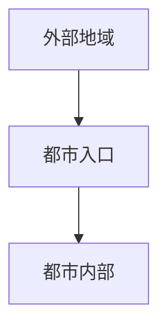
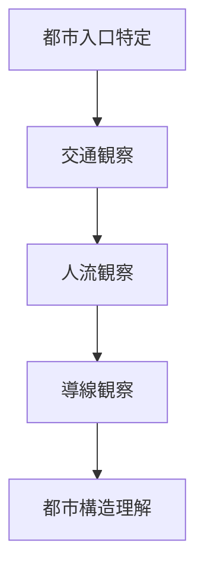

# 都市入口観察

## 概要

都市入口観察とは  
**都市に入る地点（ゲート）を観察する方法**である。

都市には

- 駅
- 港
- 橋
- 峠
- 高速IC

などの入口が存在する。

ここでは

- 人
- 交通
- 物流

が都市へ流入する。

都市入口を観察すると  
都市の構造と機能が理解できる。

---

# 都市入口の基本構造

都市入口は  
**都市と外部を接続する地点**である。

---

# 都市入口の種類

## 鉄道入口

例

- 駅
- ターミナル

特徴

人流の最大入口。

---

## 道路入口

例

- 高速IC
- 幹線道路

特徴

車交通の入口。

---

## 水運入口

例

- 港
- 河川港

特徴

物流入口。

---

## 地形入口

例

- 峠
- 谷口

特徴

自然地形による入口。

---

# 観察方法

---

# フィールドワーク質問

1 この都市の入口はどこか  
2 人はどこから入るか  
3 交通はどこから来るか  
4 観光客はどこから来るか  

---

# 観察ポイント

- 交通量  
- 人流量  
- 導線  
- 駅前構造  

---

# 例

### 鉄道都市

入口

駅

特徴

駅前が都市中心。

---

### 港町

入口

港

特徴

港周辺に商業。

---

### 城下町

入口

城下口

特徴

街道入口。

---

# 分析の目的

都市入口観察の目的は以下である。

- 都市交通理解  
- 都市導線理解  
- 観光入口理解  

---

# 関連ノート

- [[交通観察]]
- [[人流観察]]
- [[都市中心分析]]
- [[都市軸分析]]