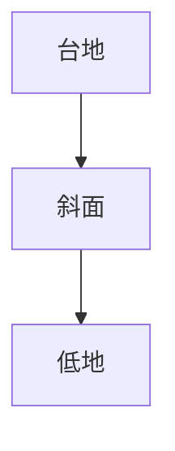
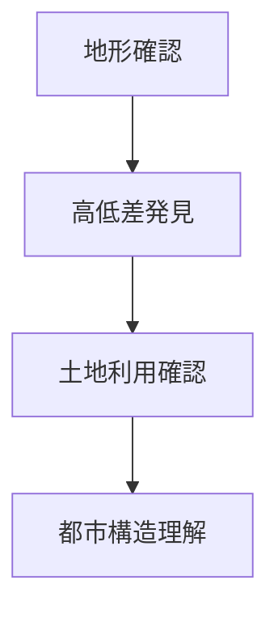

# 都市高低差観察

## 概要

都市高低差観察とは  
**都市内部の高低差や地形構造を観察する方法**である。

都市は多くの場合

- 台地
- 低地
- 河岸段丘
- 谷地形

などの地形上に形成される。

そのため都市の土地利用は  
**高低差と強く結びつく。**

例

- 城 → 台地
- 武家地 → 高台
- 商業 → 低地
- 港 → 河口

---

# 都市高低差の基本構造

都市では

- 台地
- 斜面
- 低地

の組み合わせで空間が構成される。

---

# 都市高低差の種類

## 台地

特徴

- 高地
- 防御性
- 景観

例

- 城
- 武家地
- 神社

---

## 斜面

特徴

- 道路変化
- 階段
- 坂道

例

- 坂道都市
- 谷地形

---

## 低地

特徴

- 商業
- 市場
- 港

例

- 河岸町
- 商人町

---

# 観察方法

---

# フィールドワーク質問

1 この街の高い場所はどこか  
2 低い場所はどこか  
3 坂や階段はどこにあるか  
4 高低差は土地利用とどう関係するか  

---

# 観察ポイント

- 台地
- 谷
- 坂道
- 河岸段丘

---

# 例

## 城下町

台地

城郭

低地

町人地

---

## 河岸都市

低地

港

台地

寺院

---

## 台地都市

高台

住宅

低地

商業

---

# 分析の目的

都市高低差観察の目的は

- 都市構造理解
- 土地利用理解
- 都市形成理解

である。

---

# 関連ノート

- [[地形観察]]
- [[河川観察]]
- [[土地利用分析]]
- [[都市形成プロセス分析]]