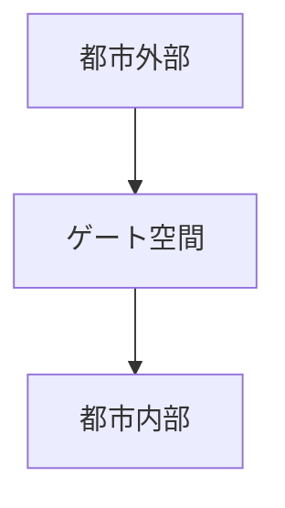
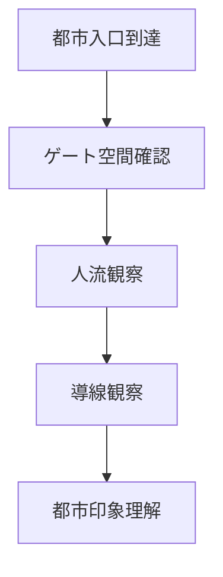

# 都市ゲート空間観察

## 概要

都市ゲート空間観察とは  
**都市の入口に形成される空間構造を観察する方法**である。

都市では入口地点に

- 駅前広場
- 城門
- 橋
- 港
- 門前町

などの空間が形成される。

これらは

- 人流
- 交通
- 観光

の結節点となり  
都市の第一印象を決める。

---

# ゲート空間の基本構造

ゲート空間は  
**都市と外部を接続する場**である。

---

# ゲート空間の種類

## 鉄道ゲート

例

- 駅前広場
- ターミナル

特徴

人流集中。

---

## 道路ゲート

例

- 橋
- 城門
- 関所

特徴

交通入口。

---

## 港ゲート

例

- 港町入口
- 港湾地区

特徴

物流入口。

---

## 宗教ゲート

例

- 門前町
- 参道入口

特徴

宗教空間入口。

---

# 観察方法

---

# フィールドワーク質問

1 都市の入口はどこか  
2 人はどこから都市に入るか  
3 ゲート空間はどう設計されているか  
4 都市の第一印象は何か  

---

# 観察ポイント

- 広場
- 橋
- 門
- 駅前

---

# 例

## 鉄道都市

ゲート

駅

特徴

駅前が都市中心。

---

## 城下町

ゲート

城門

特徴

防御構造。

---

## 港町

ゲート

港

特徴

物流入口。

---

# 分析の目的

都市ゲート空間観察の目的は

- 都市入口理解
- 都市導線理解
- 都市印象理解

である。

---

# 関連ノート

- [[都市入口観察]]
- [[公共空間観察]]
- [[都市軸分析]]
- [[都市イメージ分析]]