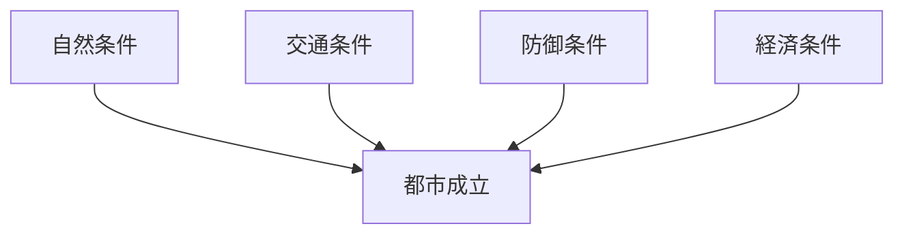
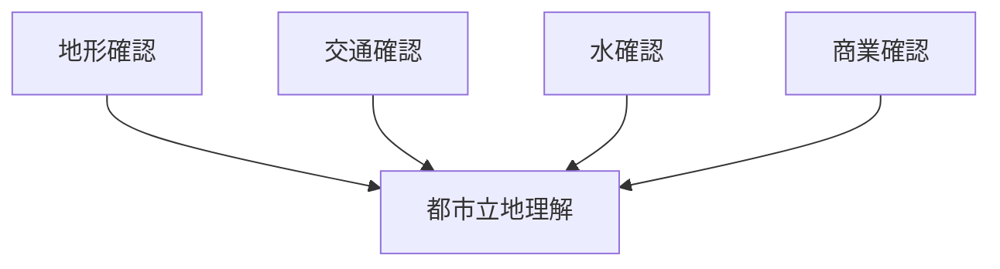

# 都市立地観察

## 概要

都市立地観察とは  
**都市がなぜその場所に成立したのかを観察する方法**である。

都市は偶然に成立するのではなく  
以下の条件によって成立する。

- 交通
- 防御
- 水
- 商業

これらの条件を観察することで  
都市の成立理由を推定できる。

---

# 都市立地の基本構造

都市は  
**複数の条件の重なり**で成立する。

---

# 立地条件

## 交通

例

- 街道交差点
- 河川交通
- 港
- 鉄道駅

特徴

人と物が集まる。

---

## 防御

例

- 台地
- 山
- 河川

特徴

防御しやすい。

---

## 水

例

- 河川
- 湧水
- 海

特徴

生活と物流。

---

## 商業

例

- 市場
- 宿場町
- 港町

特徴

経済活動。

---

# 観察方法

---

# フィールドワーク質問

1 なぜここに都市があるのか  
2 交通はどこを通るか  
3 水はどこから得られるか  
4 防御地形はあるか  

---

# 観察ポイント

- 河川
- 台地
- 街道
- 港

---

# 例

## 城下町

立地

台地

理由

防御。

---

## 港町

立地

河口

理由

物流。

---

## 宿場町

立地

街道

理由

交通。

---

# 分析の目的

都市立地観察の目的は

- 都市成立理解
- 都市構造理解
- 都市歴史理解

である。

---

# 関連ノート

- [[地形観察]]
- [[河川観察]]
- [[都市高低差観察]]
- [[都市形成プロセス分析]]