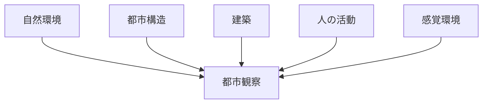

# 都市観察 Observation Hub

このHubは  
**都市フィールドワークで行う観察項目を整理する中心ノート**である。

Observationは

```
現地で何を見るか
```

を定義する。

---

# Observationの役割

都市研究では

```
Observation
↓
Method
↓
Framework
↓
Output
```

という知識の流れになる。

Observationは

- 現地観察
- フィールドノート
- 感覚記録

の基礎データになる。

---

# 都市観察の基本構造



---

# 1 自然環境観察

都市の自然条件を観察する。

- [[地形観察チェックリスト]]
- [[河川観察チェックリスト]]
- [[景観観察チェックリスト]]

観察対象

- 山
- 河川
- 海岸
- 段丘

---

# 2 都市構造観察

都市の構造を観察する。

- [[02_zettelkasten/01_knowledge/domain/fieldwork_tourism/04_method/07_observation/05_urban_observation/都市観察チェックリスト]]
- [[交通観察チェックリスト]]

観察対象

- 街路
- 交差点
- 都市中心

---

# 3 建築観察

都市の建築を観察する。

- [[建築観察チェックリスト]]
- [[宗教施設観察チェックリスト]]

観察対象

- 住宅
- 商業建築
- 寺社

---

# 4 商業・活動観察

都市の活動を観察する。

- [[商業観察チェックリスト]]
- [[観光客観察チェックリスト]]

観察対象

- 店舗
- 市場
- 観光客

---

# 5 感覚環境観察

都市の感覚的環境を観察する。

- [[音環境観察チェックリスト]]
- [[匂い環境観察チェックシート]]
- [[夜間景観観察]]

観察対象

- 音
- 匂い
- 光

---

# Observation → Method

Observationで集めた情報は  
Methodによって分析される。

例

```
景観観察
↓
景観要素分解
↓
視線構造分析
```

```
都市観察
↓
都市骨格分析
↓
都市形成プロセス分析
```

---

# 関連Hub

- [[都市フィールドワーク Method Hub]]
- [[観光分析フレーム]]