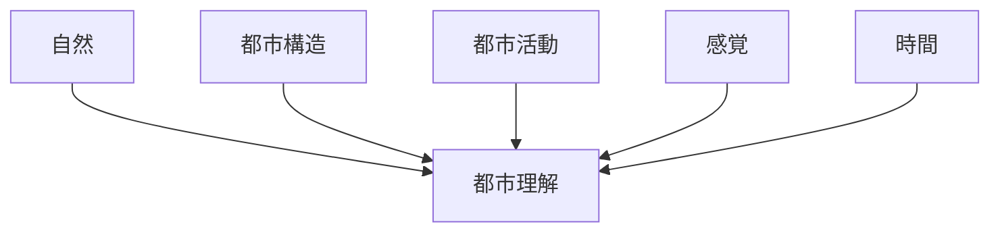
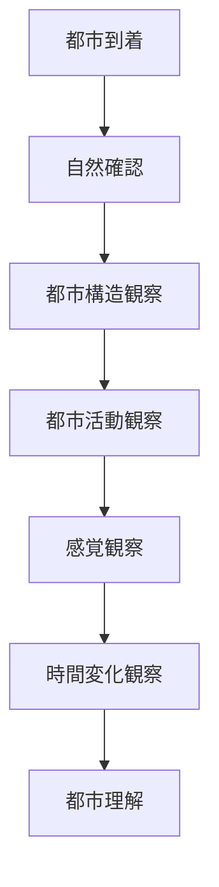

# 都市観察チェックリスト

## 概要

都市観察チェックリストとは  
**都市フィールドワークで観察する項目を体系化したもの**である。

都市は

- 地形
- 構造
- 活動
- 景観

によって構成される。

そのため都市観察は  
**複数のレイヤーから観察する必要がある。**

---

# 都市観察レイヤー

---

# 1 自然

都市の自然条件。

観察項目

- 地形
- 河川
- 海岸
- 台地
- 低地

質問

- 都市はどこに立地しているか  
- 自然地形はどう影響しているか  

関連ノート

- [[地形観察]]
- [[河川観察]]

---

# 2 都市構造

都市の空間構造。

観察項目

- 道路構造
- 街区
- 建築
- 都市軸
- 都市入口

質問

- 都市の中心はどこか  
- 道路はどこへ向かうか  
- 都市の骨格は何か  

関連ノート

- [[街区分析]]
- [[都市軸分析]]
- [[都市入口観察]]

---

# 3 都市活動

都市で何が行われているか。

観察項目

- 人流
- 商業
- 観光
- 公共空間

質問

- 人はどこから来るか  
- 人はどこへ向かうか  
- どこに滞留するか  

関連ノート

- [[人流観察]]
- [[街路活動観察]]
- [[公共空間観察]]

---

# 4 感覚

都市の雰囲気。

観察項目

- 音
- 匂い
- 景観
- 光

質問

- この場所はどんな雰囲気か  
- 何が印象的か  

関連ノート

- [[音環境観察]]
- [[匂い環境観察]]
- [[夜間景観観察]]

---

# 5 時間

都市の時間変化。

観察項目

- 朝
- 昼
- 夜
- 季節

質問

- いつ都市は活発か  
- 夜はどう変わるか  

関連ノート

- [[都市時間観察]]

---

# 観察の流れ

---

# フィールドワーク質問

1 この都市はどこに立地しているか  
2 都市の中心はどこか  
3 人はどこに集まるか  
4 この都市の特徴は何か  

---

# 分析の目的

都市観察チェックリストの目的は以下である。

- 都市構造理解
- 都市活動理解
- 観光空間理解

---

# 関連ノート

- [[地形観察]]
- [[河川観察]]
- [[街区分析]]
- [[人流観察]]
- [[公共空間観察]]
- [[都市時間観察]]