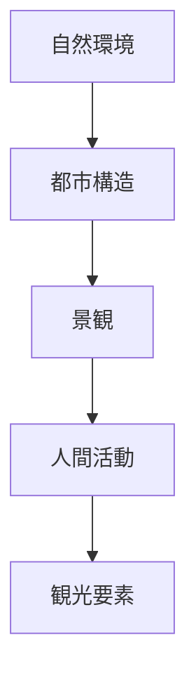
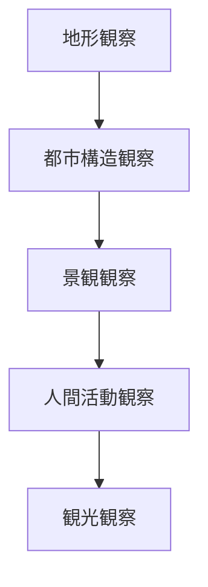

# フィールドワークチェックリスト

## 概要

フィールドワークチェックリストとは  
**現地で観察すべき要素を体系的に整理したチェックリスト**である。

フィールドワークでは

- 何を見るか
- どの順序で見るか

を整理しておくことで  
観察の質が大きく向上する。

このチェックリストは

- 都市構造
- 景観
- 人間活動

を観察するための基本項目である。

---

## フィールドワーク観察の基本構造

---

## 1 自然環境

都市の自然条件を観察する。

観察項目

- 山
- 台地
- 河川
- 海岸
- 谷

確認するポイント

- 高低差
- 水系
- 地形構造

---

## 2 都市構造

都市の空間構造を観察する。

観察項目

- 都市中心
- 街路
- 街区
- 境界

確認するポイント

- 街路形状
- 街区構造
- 都市中心の位置

---

## 3 景観

都市景観を観察する。

観察項目

- 建築
- ランドマーク
- 景観軸
- スカイライン

確認するポイント

- 視覚構造
- 景観の連続性
- 視点場

---

## 4 人間活動

地域社会の活動を観察する。

観察項目

- 商業
- 交通
- 観光
- 生活

確認するポイント

- 人の流れ
- 活動時間
- 施設利用

---

## 5 観光要素

観光地としての要素を観察する。

観察項目

- 観光資源
- 観光拠点
- 観光動線
- 観光施設

確認するポイント

- 観光客の流れ
- 人気スポット
- 観光体験

---

## フィールドワークの観察順序

---

## フィールドワークの基本質問

現地では次を考える。

1 この場所の地形は何か  
2 都市の中心はどこか  
3 街路はどう形成されているか  
4 どんな景観があるか  
5 人は何をしているか  

---

## フィールドワークの目的

このチェックリストの目的は以下である。

- 観察の体系化  
- 都市構造理解  
- 観光資源発見  

---

## 関連ノート

- [[02_zettelkasten/01_knowledge/domain/photography/photo_fieldwork/フィールドワーク観察]]
- [[町読みフレーム]]
- [[景観読解]]
- [[観光資源評価フレーム]]