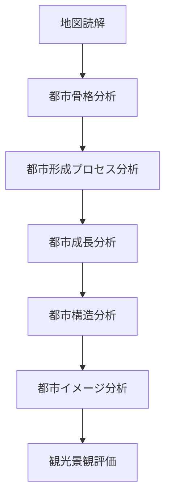

# 都市フィールドワーク Method Hub

このHubは  
**都市フィールドワークで使用する分析Methodの全体構造**を整理する。

都市理解は次の順序で進む。

```
地図読解
↓
都市骨格理解
↓
都市形成理解
↓
都市構造分析
↓
都市認知理解
↓
観光評価
```

---

# 都市フィールドワーク全体構造



---

# 1 事前分析

都市を訪れる前に行う分析。

- [[地図読解法]]
- [[古地図比較]]

目的

- 都市立地理解
- 都市形成推定

---

# 2 都市骨格分析

都市の基本構造を理解する。

- [[都市骨格分析]]
- [[河川分析]]
- [[都市軸分析]]

目的

- 都市骨格理解
- 空間構造理解

---

# 3 都市形成理解

都市が成立した理由を理解する。

- [[都市形成プロセス分析]]
- [[都市比較フレーム]]

目的

- 都市タイプ理解
- 都市成立理解

---

# 4 都市成長理解

都市の拡張を分析する。

- [[都市成長分析]]
- [[都市境界分析]]

目的

- 都市拡張理解
- 都市発展理解

---

# 5 都市構造分析

都市内部構造を分析する。

- [[空間構造分析]]
- [[街区分析]]
- [[都市中心分析]]
- [[土地利用分析]]

目的

- 都市内部構造理解

---

# 6 都市認知分析

人が都市をどのように認識するかを分析する。

- [[都市イメージ分析]]
- [[ランドマーク分析]]
- [[視線構造分析]]

目的

- 都市景観理解
- 都市認知理解

---

# 7 観光分析

都市の観光価値を分析する。

- [[観光動線分析]]
- [[観光景観評価]]

目的

- 観光資源理解
- 観光設計

---

# Methodの役割

都市フィールドワークでは

```
Observation
↓
Method
↓
Framework
↓
Output
```

という構造で知識が流れる。

---

# 関連Hub

- [[都市観察チェックリスト Hub]]
- [[都市構造分析フレーム]]
- [[観光分析フレーム]]

---

# このHubの役割

このHubは

- 都市読解
- 観光研究
- フィールドワーク

の **思考順序を整理する中心ノート**である。