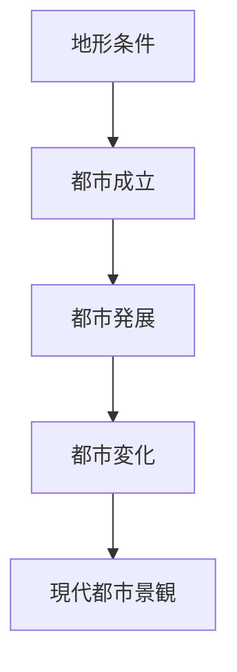
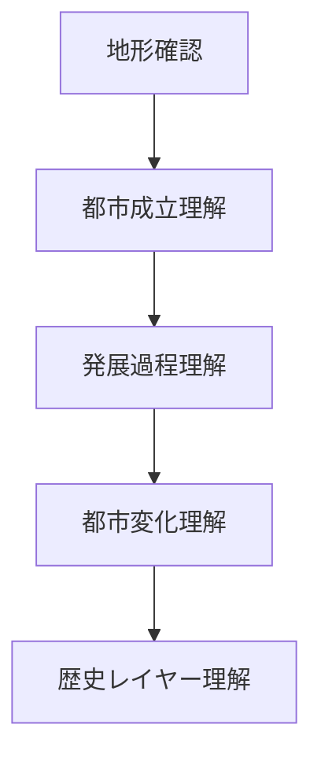

# 歴史都市分析フレーム

## 概要

歴史都市分析フレームとは  
**都市の形成と変化を時間軸で理解するための分析フレーム**である。

都市は一度に完成したものではなく、

- 成立
- 発展
- 変化

という歴史過程を経て形成される。

この時間構造を理解することで

- 都市景観の意味
- 都市構造の理由
- 観光資源の価値

を理解することができる。

---

## 歴史都市の基本構造

---

## 歴史都市の分析要素

歴史都市は主に次の要素で理解する。

### 都市成立

都市が成立した理由。

例

- 城
- 港
- 寺社
- 交通

成立要因は都市の基本構造を決める。

---

### 都市発展

都市の発展段階。

例

- 商業発展
- 政治中心
- 宗教中心

発展過程は都市文化を形成する。

---

### 都市変化

都市は時代とともに変化する。

例

- 近代化
- 産業化
- 観光化

変化は都市景観に現れる。

---

### 歴史レイヤー

都市には複数の時代が重なっている。

例

- 中世
- 近世
- 近代
- 現代

これを歴史レイヤーという。

---

## 歴史都市分析のプロセス

---

## フィールドワークでの質問

都市を見るときは次を考える。

1 この都市はいつ成立したか  
2 なぜこの都市は成立したか  
3 この都市はどのように発展したか  
4 現在の景観はどの時代のものか  

---

## 例

### 金沢

成立

- 城下町

発展

- 加賀藩の政治都市

変化

- 明治以降の都市拡張

歴史レイヤー

- 城
- 武家屋敷
- 茶屋街

現代景観

**歴史都市観光地**

---

### 京都

成立

- 古代都

発展

- 政治中心都市

変化

- 近代都市化

歴史レイヤー

- 古代都市
- 中世寺社
- 近代建築

---

## 歴史都市分析の目的

このフレームの目的は以下である。

- 都市形成理解  
- 都市景観理解  
- 観光資源理解  
- 歴史ストーリー構築  

---

## 関連ノート

- [[都市構造分析フレーム]]
- [[都市レイヤー]]
- [[都市アイデンティティ]]
- [[観光価値]]