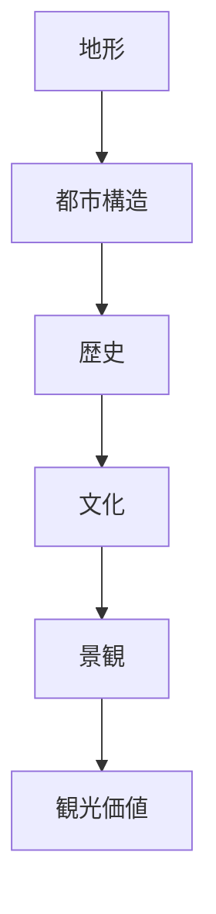
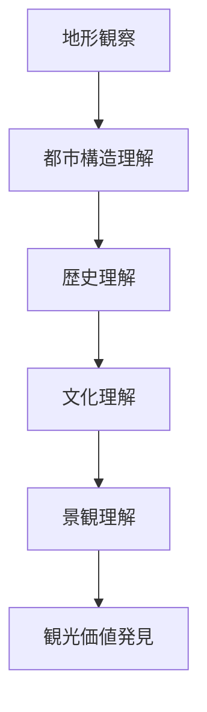

# 町読みフレーム

## 概要

町読みとは  
**街を歩きながら、その空間構造・歴史・文化を読み解く行為**である。

都市や町は偶然に形成されたのではなく、

- 地形
- 歴史
- 経済
- 文化

によって形成される。

町読みフレームは  
これらを体系的に理解するための分析フレームである。

---

## 町読みの基本構造

---

## 町読みの基本質問

町を見るときは次を考える。

### 1 地形

この町はどんな地形にあるか。

例

- 台地
- 河岸段丘
- 扇状地
- 谷

地形は都市の成立条件を説明する。

---

### 2 都市構造

都市の構造はどうなっているか。

例

- 城
- 街路
- 街区
- 市場

都市構造は歴史を反映する。

---

### 3 歴史

この町は何の町か。

例

- 城下町
- 宿場町
- 港町
- 門前町

町の性格は歴史で決まる。

---

### 4 文化

この町にはどんな文化があるか。

例

- 寺社
- 祭礼
- 伝統産業

文化は町の意味を形成する。

---

### 5 景観

どんな景観があるか。

例

- 街並み
- ランドマーク
- 景観軸

景観は町の特徴を視覚的に表す。

---

### 6 観光価値

観光客は何を見るか。

例

- 観光拠点
- 観光動線
- 観光資源

---

## 町読みのプロセス

町読みは次の順序で行う。

---

## フィールドワークでの実践

町を歩くときは以下を見る。

### 地形

- 高低差
- 河川
- 山

---

### 街路

- 街路の形
- 道幅
- 曲がり

---

### 建築

- 建物の年代
- 建築様式
- 用途

---

### 人間活動

- 商業
- 生活
- 観光

---

## 例

### 金沢

地形

- 河岸段丘

都市構造

- 城
- 武家地
- 寺町
- 町人地

歴史

- 城下町

文化

- 武家文化
- 茶屋文化

観光価値

- 武家屋敷
- 茶屋街
- 兼六園

---

## 町読みの目的

町読みの目的は以下である。

- 都市構造理解  
- 歴史理解  
- 文化理解  
- 観光価値発見  

---

## 関連ノート

- [[02_zettelkasten/01_knowledge/domain/photography/photo_fieldwork/フィールドワーク観察]]
- [[景観読解]]
- [[都市レイヤー]]
- [[観光価値]]