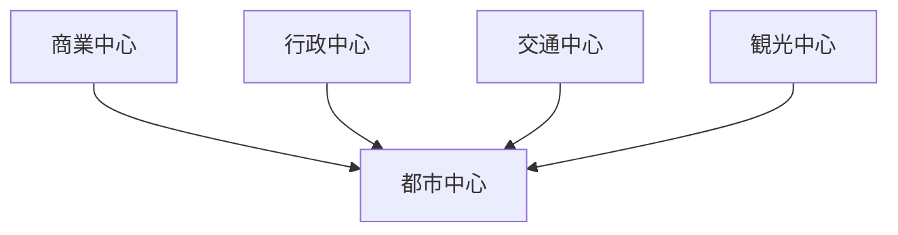
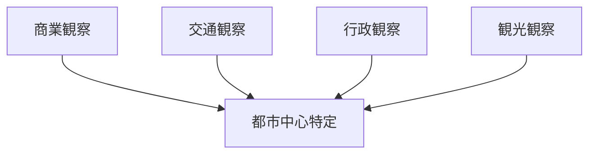

# 都市中心分析

## 概要

都市中心分析とは  
**都市の中心となる場所を特定し、その役割を分析する方法**である。

都市中心には

- 商業中心
- 行政中心
- 交通中心

などが存在する。

---

# 都市中心の基本構造

---

# 主な都市中心

## 商業中心

特徴

- 商店
- 飲食

例

- 繁華街

---

## 行政中心

特徴

- 官庁
- 公共施設

---

## 交通中心

特徴

- 駅
- バスターミナル

---

## 観光中心

特徴

- 観光地
- 観光施設

---

# 分析手順

---

# フィールドワーク質問

1 人が最も集まる場所はどこか  
2 商業はどこに集中するか  
3 交通の中心はどこか  

---

# 目的

- 都市構造理解  
- 都市機能理解  

---

# 関連ノート

- [[土地利用分析]]
- [[交通観察チェックリスト]]
- [[商業観察チェックリスト]]