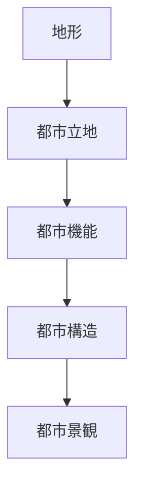
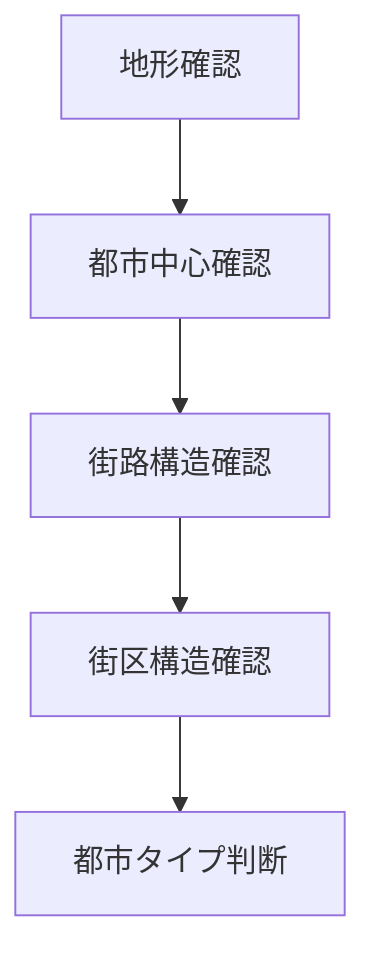

# 都市構造分析フレーム

## 概要

都市構造分析フレームとは  
**都市の空間構造を分析するためのフレームワーク**である。

都市はランダムに形成されたのではなく、

- 地形
- 防御
- 交通
- 経済

などの要因によって形成される。

都市構造を理解することで

- 都市成立の理由
- 歴史的都市機能
- 景観形成

を理解することができる。

---

## 都市構造の基本構造

---

## 都市構造の基本要素

都市構造は主に以下の要素で構成される。

### 中心

都市の中心となる場所。

例

- 城
- 市場
- 港
- 寺社

中心は都市機能を象徴する。

---

### 街路

都市の交通構造。

例

- 直交街路
- 放射街路
- 曲線街路

街路は都市の形成過程を示す。

---

### 街区

都市の区画。

例

- 武家地
- 町人地
- 寺町

街区は都市社会構造を反映する。

---

### 境界

都市の区切り。

例

- 城壁
- 河川
- 堀
- 山

境界は都市の防御や地形条件を示す。

---

## 都市構造のタイプ

### 城下町

中心

- 城

構造

- 武家地
- 町人地
- 寺町

例

- 金沢
- 松本
- 姫路

---

### 宿場町

中心

- 宿場

構造

- 街道
- 宿
- 商店

例

- 奈良井
- 妻籠

---

### 港町

中心

- 港

構造

- 港湾
- 市場
- 商業地区

例

- 長崎
- 函館

---

### 門前町

中心

- 寺社

構造

- 参道
- 商店
- 宿坊

例

- 伊勢
- 高野山

---

## 都市構造分析のプロセス

---

## フィールドワークでの質問

都市を見るときは次を考える。

1 都市の中心は何か  
2 街路はどのように形成されているか  
3 街区はどのように分かれているか  
4 都市の境界はどこか  

---

## 例

### 金沢

中心

- 金沢城

街区

- 武家地
- 町人地
- 寺町

地形

- 河岸段丘

都市タイプ

**城下町**

---

### 京都

中心

- 御所

街路

- 碁盤目

都市タイプ

**計画都市**

---

## 都市構造分析の目的

このフレームの目的は以下である。

- 都市構造理解  
- 都市成立条件理解  
- 歴史理解  
- 観光資源理解  

---

## 関連ノート

- [[町読みフレーム]]
- [[都市レイヤー]]
- [[地形解釈]]
- [[02_zettelkasten/01_knowledge/domain/fieldwork_tourism/歴史都市分析フレーム]]