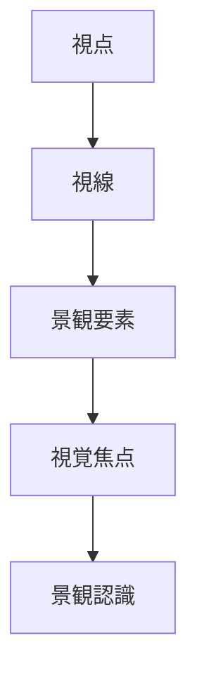
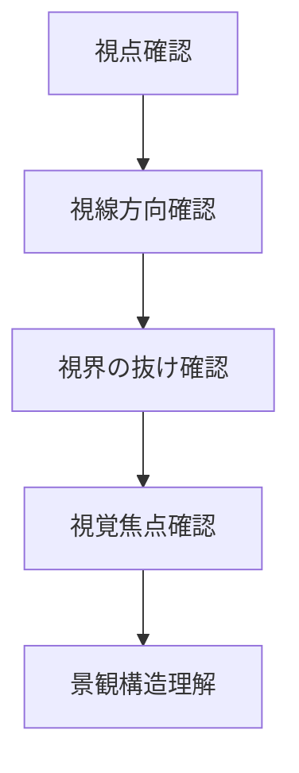

# 視線構造分析

## 概要

視線構造分析とは  
**人の視線がどこに向かい、どのように景観を認識しているかを分析する方法**である。

都市景観は

- 視線の方向
- 視界の抜け
- 視覚焦点

によって構成される。

この構造を理解することで

- 景観魅力
- 都市デザイン
- 観光景観

を理解できる。

---

# 視線構造の基本構造

---

# 視線構造の要素

## 視点

人が立っている位置。

例

- 広場
- 橋
- 展望台

観察ポイント

景観は視点によって変わる。

---

## 視線方向

人が見る方向。

例

- 街路方向
- 河川方向
- 山方向

観察ポイント

視線は都市構造に影響される。

---

## 視界の抜け

視界が遠くまで広がる場所。

例

- 直線道路
- 河川景観
- 谷景観

---

## 視覚焦点

視線が集中する対象。

例

- 城
- タワー
- 寺社

関連ノート

- [[ランドマーク分析]]

---

# 視線構造分析の手順

---

# フィールドワーク質問

1 人はどこから景観を見るか  
2 視線はどの方向に向くか  
3 視界はどこに抜けるか  
4 視線は何に集まるか  

---

# 例

### 京都

視点

橋

視線

東山方向

視覚焦点

八坂塔

---

### 金沢

視点

橋

視線

城方向

視覚焦点

金沢城

---

### 東京

視点

大通り

視線

タワー方向

視覚焦点

東京タワー

---

# 分析の目的

視線構造分析の目的は以下である。

- 景観魅力理解  
- 観光景観理解  
- 都市景観理解  

---

# 関連ノート

- [[景観要素分解]]
- [[ランドマーク分析]]
- [[都市イメージ分析]]
- [[都市骨格分析]]