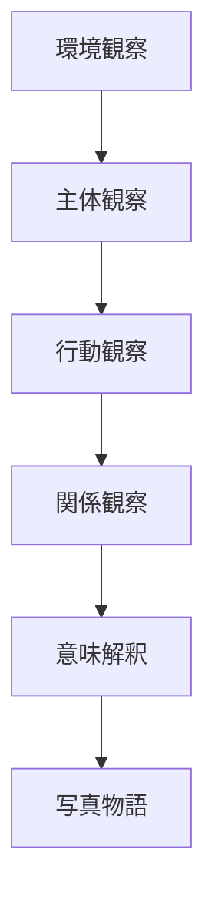

# Photo Story Observation Method

写真の物語は

**人物 + 行動 + 環境 + 文脈**

が重なるときに生まれる。

---

# 観察プロセス



## STEP 1 環境を見る（Environment）
まず 舞台 を見る。
観察
- どこか
- どんな空間か
- 光はどうか
- 何が特徴か
例：港
- 船
- 網
- 海
- 朝日
ここでまだ人物は中心ではない。
## STEP 2 主体を見る（Subject）
次に 誰がいるか を見る。
観察
- 人
- 動物
- 乗り物
- 道具

例
- 漁師
- 観光客
- 市場の店主
ここで主体が決まる。
## STEP 3 行動を見る（Action）
写真の物語は 行動 があると強くなる。
観察
- 何をしているか
- 何を持っているか
- どこへ向かっているか

例
- 網を引く
- 魚を運ぶ
- 客に売る
ここで初めてストーリーの核が見える。
## STEP 4 関係を見る（Relationship）
次に 関係 を見る。
観察
- 人と人
- 人と場所
- 人と仕事　
- 人と自然

例
- 漁師と海
- 売り手と客
- 人と街
ここで物語が立体化すふ。
## STEP 5 意味を考える（Meaning）
最後に、この場面は何を示しているかを考える。
例
漁師 + 網 + 朝日
↓
労働の始まり

ここで写真の物語が成立する。
# 写真の物語テンプレート

誰が
↓
何をしている
↓
どこで
↓
なぜ重要か

例
- 漁師が網を引いている
- 港で地域の生活を支えている
# 物語が生まれやすい状況
次の条件が揃うと強い。
- 行動：動きがある
- 関係：人と何かの関係
- 環境：場所が意味を持つ
- 感情：表情や緊張
- 変化：何かが起きる瞬間

# 写真の物語の型

|型|物語|
|---|---|
|行動|仕事・移動|
|関係|親子・客と店|
|空間|人と街|
|文化|祭り・生活|
|瞬間|決定的瞬間|

---

# 実例

### 普通の写真

```
漁港
```

ただの風景。

---

### 物語のある写真

```
漁港
＋
漁師
＋
網
＋
朝日
```

意味

```
漁業の生活
```

---

# フィールドワークでの使い方

街を歩くときは

```
環境
↓
人
↓
行動
↓
関係
↓
意味
```

の順で見る。
これは都市観察にも応用できる。

---

# 重要

写真の物語は、探すものではなく、観察から立ち上がるもの。

---

# まとめ

写真の物語とは

```
状況の意味
```

構造は


主体
＋
行動
＋
環境
＋
文脈

