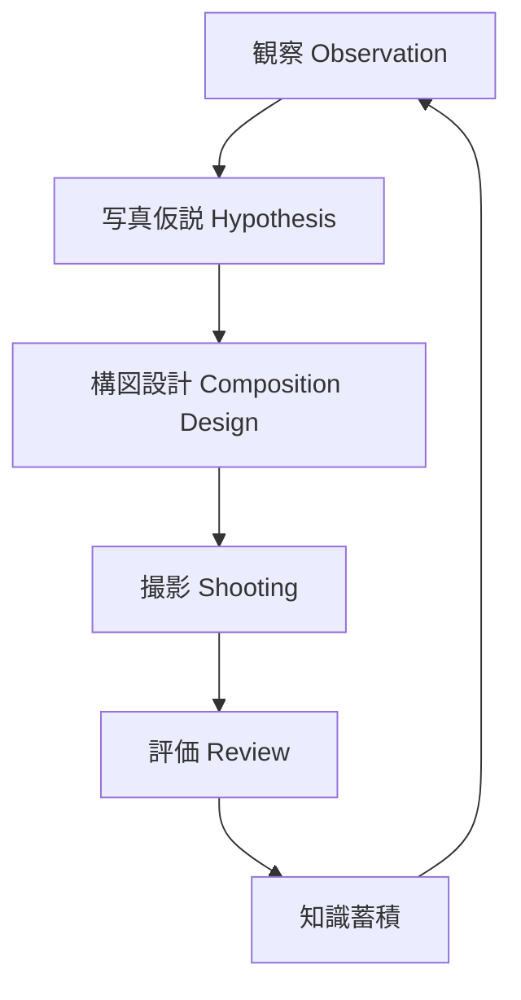

# Photo Thinking Engine

写真撮影は

**観察 → 仮説 → 構図設計 → 撮影 → 評価**

の思考プロセスで進む。

---

# 全体構造

---

# ノート一覧

- [[写真観察]]
- [[02_zettelkasten/01_knowledge/domain/photography/Photo_Thinking_Engine/写真仮説]]
- [[構図設計]]
- [[撮影意思決定]]
- [[写真評価]]