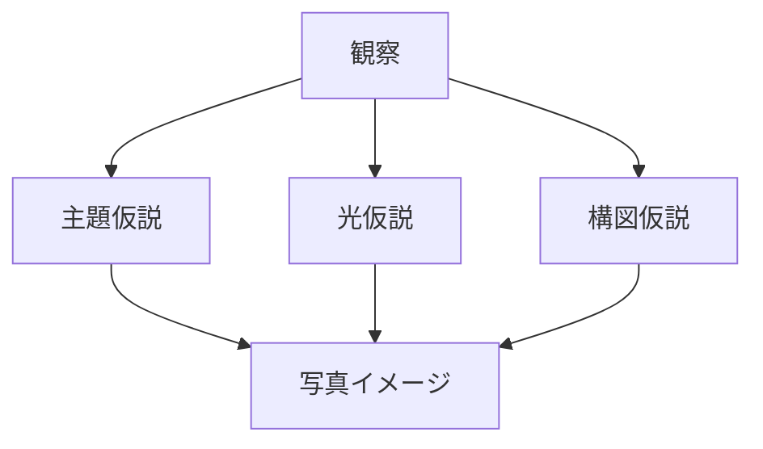

# 写真仮説

写真家は観察から

**写真の仮説**

を立てる。

---

# 仮説構造

```mermaid
graph TD

A[観察]

A --> B[主題仮説]
A --> C[光仮説]
A --> D[構図仮説]

B --> E[写真イメージ]
C --> E
D --> E
```

---

# 仮説例

主題  
「漁師の生活」

光  
「逆光がドラマを作る」

構図  
「導線構図」

---

# 仮説の問い

- この写真の主役は誰か
- どんな光が最適か
- どんな構図が効果的か