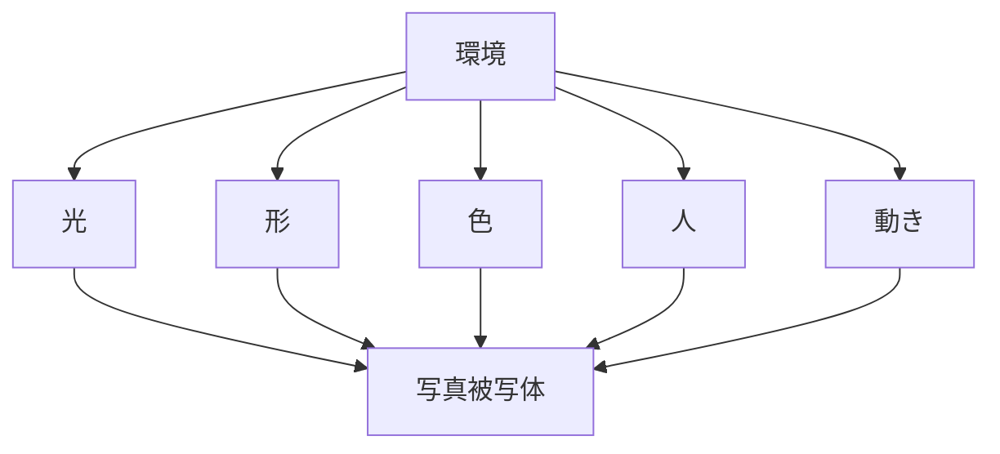

# 写真観察

写真の最初の段階は

**環境の観察**

である。

---

# 観察構造

```mermaid
graph TD

A[環境]

A --> B[光]
A --> C[形]
A --> D[色]
A --> E[人]
A --> F[動き]

B --> G[写真被写体]
C --> G
D --> G
E --> G
F --> G
```

---

# 観察の問い

- 光はどこから来ているか
- 視線はどこへ流れるか
- 物語は何か